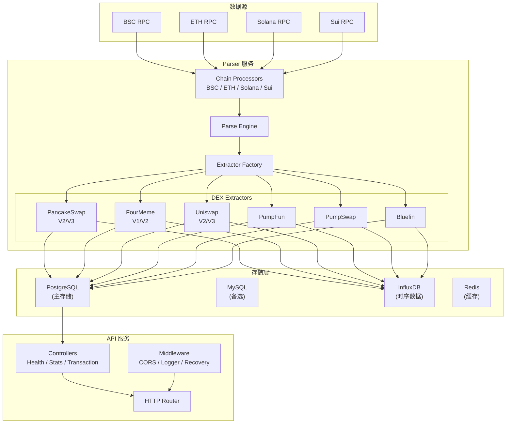
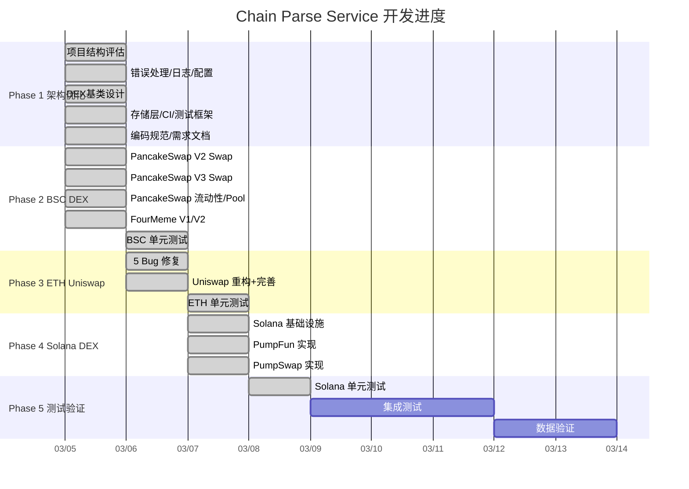
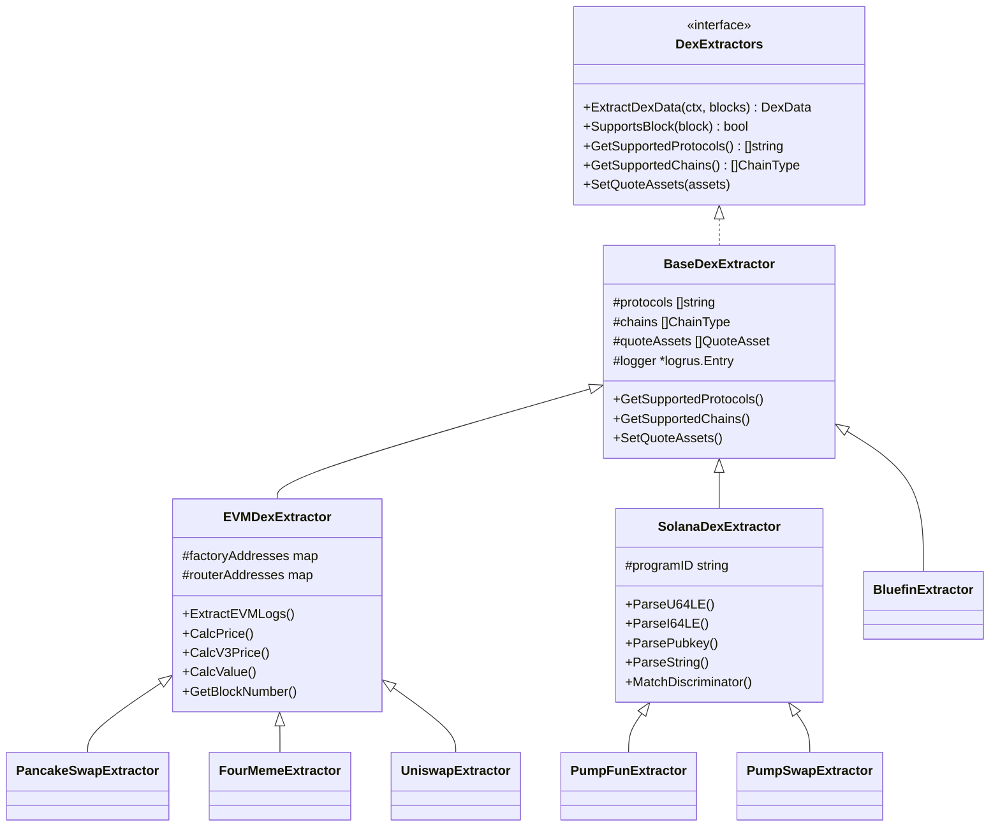
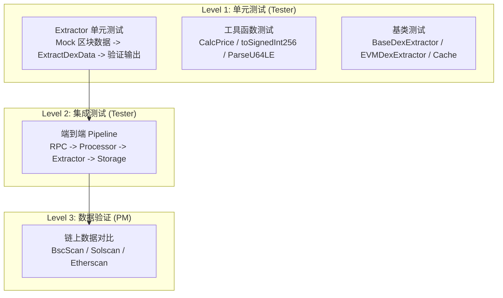
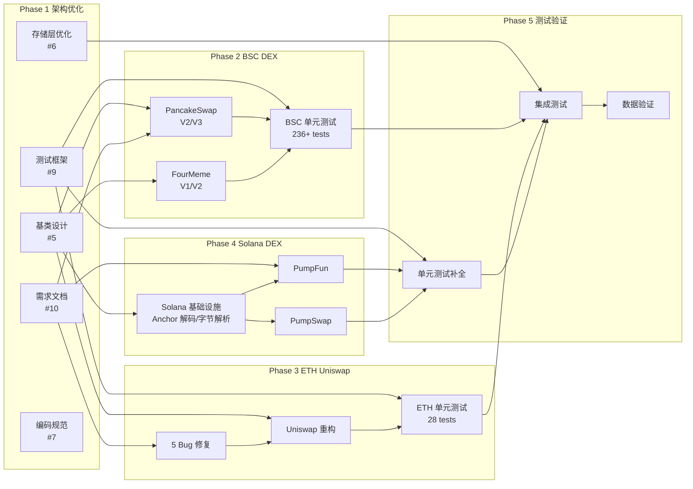
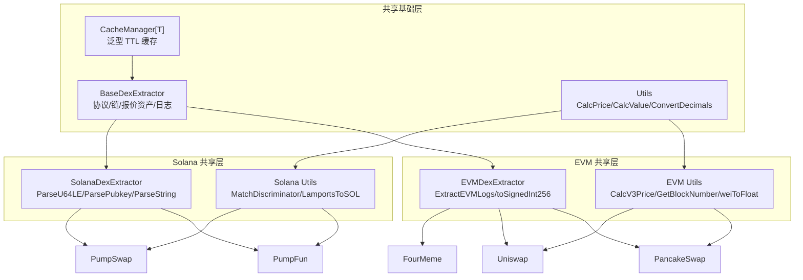

# Chain Parse Service - 产品需求文档 (PRD)

> **版本**: v1.0
> **最后更新**: 2026-03-08
> **负责人**: PM Agent
> **状态**: 活跃维护中

---

## 目录

1. [项目概述](#1-项目概述)
2. [Phase 规划总览](#2-phase-规划总览)
3. [Phase 1 详细 - 架构优化](#3-phase-1-详细---架构优化)
4. [Phase 2 详细 - BSC链DEX完善](#4-phase-2-详细---bsc链dex完善)
5. [Phase 3 详细 - ETH链Uniswap](#5-phase-3-详细---eth链uniswap)
6. [Phase 4 详细 - Solana链DEX](#6-phase-4-详细---solana链dex)
7. [Phase 5 详细 - 测试与验证](#7-phase-5-详细---测试与验证)
8. [非功能性需求](#8-非功能性需求)
9. [开发优先级与依赖关系](#9-开发优先级与依赖关系)
10. [术语表](#10-术语表)
11. [待办事项汇总](#11-待办事项汇总)

---

## 1. 项目概述

### 1.1 产品定位

Chain Parse Service 是一个**企业级多链 DEX 数据解析服务**，负责实时监听并解析多条区块链上的去中心化交易所 (DEX) 链上事件，将非结构化的链上原始数据转化为结构化的交易、池子、流动性、代币和储备金数据，为上层应用（数据分析平台、交易监控系统、行情聚合器等）提供标准化的数据源。

### 1.2 核心价值

| 价值维度 | 描述 |
|---------|------|
| **多链统一** | 一套架构覆盖 EVM (BSC/ETH)、Solana、Sui 四条主流链，统一数据模型 |
| **协议全覆盖** | 支持 AMM (PancakeSwap/Uniswap)、Bonding Curve (PumpFun/FourMeme)、Move DEX (Bluefin) 多种协议模型 |
| **实时解析** | 逐区块解析链上事件，数据延迟控制在秒级 |
| **高可靠性** | 错误重试、优雅降级、数据校验、断点续扫机制 |
| **可扩展性** | 基于 Extractor 工厂模式，新增 DEX 仅需实现接口并注册 |

### 1.3 支持的链与协议

| 链 | 协议 | 类型 | 支持事件 | 状态 |
|---|------|------|---------|------|
| BSC | PancakeSwap V2 | AMM (恒定乘积) | Swap, Mint, Burn, PairCreated | 已完成 |
| BSC | PancakeSwap V3 | AMM (集中流动性) | Swap, Mint, Burn, PoolCreated | 已完成 |
| BSC | FourMeme V1 | Bonding Curve | TokenCreate, TokenPurchase, TokenSale | 已完成 |
| BSC | FourMeme V2 | Bonding Curve | TokenCreate, TokenPurchase, TokenSale, LiquidityAdded | 已完成 |
| ETH | Uniswap V2 | AMM (恒定乘积) | Swap, Mint, Burn, PairCreated | 已完成 |
| ETH | Uniswap V3 | AMM (集中流动性) | Swap, Mint, Burn, PoolCreated | 已完成 |
| Solana | PumpFun | Bonding Curve | CreateEvent, TradeEvent, CompleteEvent | 已完成 |
| Solana | PumpSwap | AMM (恒定乘积) | BuyEvent, SellEvent, CreatePoolEvent, DepositEvent, WithdrawEvent | 已完成 |
| Sui | Bluefin | CLMM | Swap | 已完成 |
| Sui | Cetus | CLMM | Swap | 未启用 |
| Sui | Turbos | CLMM | Swap | 未启用 |

### 1.4 系统架构概览



### 1.5 数据模型

系统使用 5 个核心数据模型，对应 PostgreSQL 中的 5 张业务表：

| 模型 | 数据库表 | 描述 | 核心字段 |
|------|---------|------|---------|
| Transaction | `dex_transactions` | DEX 交易/Swap 记录 | addr, pool, hash, from, side, amount, price, value, block_number |
| Pool | `dex_pools` | 池子/交易对创建记录 | addr, factory, protocol, token0, token1, fee |
| Liquidity | `dex_liquidities` | 流动性添加/移除记录 | addr, pool, hash, from, side, amount, value, key |
| Token | `dex_tokens` | 代币信息 | addr, name, symbol, decimals, is_stable |
| Reserve | `dex_reserves` | 池子储备金快照 | addr, amount0, amount1, time |

### 1.6 配置管理

系统采用三层配置合并策略：

```
base.yaml (通用默认配置)
    -> {chain}.yaml (链特定配置: bsc/ethereum/solana/sui)
        -> 环境变量 (运行时覆盖)
```

每条链的配置包含：
- **chains**: RPC 端点、链 ID、批处理大小、超时设置
- **protocols**: 各 DEX 协议启用状态、合约地址/Program ID
- **quoteAssets**: 报价资产列表及优先级排序
- **processor**: 并发度、重试策略
- **storage**: 存储后端选择及连接参数

---

## 2. Phase 规划总览

| 阶段 | 名称 | 核心目标 | 负责团队 | 状态 | 完成度 |
|------|------|---------|---------|------|--------|
| Phase 1 | 架构优化 | 建立企业级框架、统一代码规范、基类设计 | Architect + Developer | **已完成** | 10/10 (100%) |
| Phase 2 | BSC链DEX完善 | PancakeSwap V2/V3 + FourMeme V1/V2 全事件覆盖 | Developer + Tester | **已完成** | 236+ tests |
| Phase 3 | ETH链Uniswap | Uniswap V2/V3 全事件覆盖，修复 5 个已知 Bug | Developer + Tester | **已完成** | 28 tests, 5 bugs fixed |
| Phase 4 | Solana链DEX | PumpFun + PumpSwap 实现，Solana 基础设施搭建 | Developer | **已完成** | 全部事件已实现 |
| Phase 5 | 测试与验证 | 全链路测试、数据验证、性能基准 | Tester + PM | **进行中** | -- |



---

## 3. Phase 1 详细 - 架构优化

### 3.1 目标

将项目从原型代码重构为企业级架构，建立统一的代码规范、错误处理、日志体系、配置管理，设计可扩展的 DEX Extractor 基类层次。

### 3.2 任务列表

| ID | 任务 | 负责人 | 状态 | 交付物 |
|---|------|--------|------|--------|
| 1.1 | 项目结构评估 | Architect | 已完成 | `ARCHITECTURE_ASSESSMENT.md` |
| 1.2 | 统一错误处理框架 | Architect | 已完成 | `ERROR_HANDLING_DESIGN.md`, `ERROR_HANDLING_GUIDE.md` |
| 1.3 | 日志框架优化 | Architect | 已完成 | `LOGGING_GUIDE.md`, 结构化日志规范 |
| 1.4 | 配置管理重构 | Developer | 已完成 | `CONFIGURATION_GUIDE.md`, 三层合并机制 |
| 1.5 | DEX 提取器基类设计 | Architect | 已完成 | `base_extractor.go`, `evm_extractor.go`, `solana_extractor.go`, `utils.go`, `cache.go` |
| 1.6 | 存储层优化 | Developer | 已完成 | 统一存储接口, 批量写入, 事务支持 |
| 1.7 | 编码规范文档 | Architect | 已完成 | `CODING_STANDARDS.md` |
| 1.8 | CI/CD 基础搭建 | Developer | 已完成 | Makefile 优化, Docker 多阶段构建 |
| 1.9 | 测试框架搭建 | Tester | 已完成 | Mock 框架, 测试辅助工具, testdata 目录 |
| 1.10 | 需求文档完善 | PM | 已完成 | `REQUIREMENTS.md`, 5 个 DEX 详细需求 |

### 3.3 DEX Extractor 基类层次



### 3.4 验收标准

- [x] 架构评估报告覆盖所有模块，识别 10+ 优化点
- [x] 错误处理框架支持错误码体系和上下文包装 (`fmt.Errorf(...: %w, err)`)
- [x] 日志格式统一，支持 service/module 字段，级别使用合理
- [x] 配置管理支持 base.yaml -> chain.yaml -> 环境变量 三层合并
- [x] DEX 基类消除 200+ 行重复代码，新增 DEX 仅需扩展基类
- [x] 存储层支持 PostgreSQL/MySQL/InfluxDB，统一接口
- [x] `CODING_STANDARDS.md` 包含命名、测试、日志、Git、新 DEX 检查清单
- [x] Makefile 支持 `make build-parser`, `make build-api`, `make test`
- [x] 测试框架支持 table-driven tests, mock 数据构造, testdata 辅助函数
- [x] 需求文档覆盖 5 个 DEX 的合约地址、事件签名、数据结构、字段映射、验收标准

### 3.5 关键设计决策

| 决策 | 选型 | 原因 |
|------|------|------|
| 组合 vs 继承 | 组合 (嵌入式结构体) | Go 语言推荐，避免深层继承链 |
| 缓存方案 | 泛型 TTL Cache (`NewCacheManager[T]()`) | 线程安全、可配置过期时间 |
| 日志库 | logrus (结构化日志) | 社区成熟、支持字段注入 |
| 主存储 | PostgreSQL | JSONB 支持, UPSERT, 强一致性 |
| 配置库 | YAML + 分层合并 | 清晰分离共享/链特定配置 |

---

## 4. Phase 2 详细 - BSC链DEX完善

### 4.1 目标

完善 BSC 链上 PancakeSwap (V2/V3) 和 FourMeme (V1/V2) 的全部 DEX 事件解析能力。

### 4.2 PancakeSwap V2/V3

#### 4.2.1 合约地址

| 合约 | 地址 | 版本 |
|------|------|------|
| V2 Factory | `0xcA143Ce32Fe78f1f7019d7d551a6402fC5350c73` | V2 |
| V3 Factory | `0x0BFbCF9fa4f9C56B0F40a671Ad40E0805A091865` | V3 |

#### 4.2.2 事件覆盖

| 事件 | 版本 | Topic0 | 输出模型 | 状态 |
|------|------|--------|---------|------|
| Swap | V2 | `0xd78ad95...` | Transaction (side="swap") | 已完成 |
| Swap | V3 | `0xc42079f...` | Transaction (side="swap") | 已完成 |
| Mint | V2 | `0x4c209b5...` | Liquidity (side="add") | 已完成 |
| Burn | V2 | `0xdccd412...` | Liquidity (side="remove") | 已完成 |
| Mint | V3 | `0x7a53080...` | Liquidity (side="add") | 已完成 |
| Burn | V3 | `0x0c396cd...` | Liquidity (side="remove") | 已完成 |
| PairCreated | V2 | `0x0d3648b...` | Pool | 已完成 |
| PoolCreated | V3 | `0x783cca1...` | Pool | 已完成 |

#### 4.2.3 关键技术点

- **V3 Swap**: 使用 `toSignedInt256()` 处理有符号 amount0/amount1；正值 = 流入池子（用户付出），负值 = 流出池子（用户收到）
- **V3 价格计算**: `price = (sqrtPriceX96 / 2^96)^2`，使用 `CalcV3Price()` 统一计算
- **V3 Mint 偏移**: data 包含额外 sender 字段，amount0/amount1 在 offset 64/96（非 0/32）
- **Pool 地址解析**: V2 PairCreated 从 data[0:32] 解析 pair 地址；V3 PoolCreated 从 data[32:64] 解析 pool 地址
- **QuoteAssets**: WBNB (rank=95) / USDT (rank=100) / USDC (rank=99) / BUSD (rank=98)

#### 4.2.4 验收标准 (AC-PS)

| ID | 标准 | 状态 |
|----|------|------|
| AC-PS-1 | 正确解析 V2 Swap，提取 amount0In/amount1In/amount0Out/amount1Out | 已通过 |
| AC-PS-2 | 正确解析 V3 Swap，signed int256 处理 + sqrtPriceX96 价格计算 | 已通过 |
| AC-PS-3 | 正确解析 V2/V3 Mint，映射为 side="add" 的 Liquidity | 已通过 |
| AC-PS-4 | 正确解析 V2/V3 Burn，映射为 side="remove" 的 Liquidity | 已通过 |
| AC-PS-5 | 正确解析 PairCreated，token0/token1/pair 地址提取正确 | 已通过 |
| AC-PS-6 | 正确解析 PoolCreated，token0/token1/fee/pool 地址提取正确 | 已通过 |
| AC-PS-7 | 同一交易中多个 swap 事件 SwapIndex 递增 | 已通过 |
| AC-PS-8 | 数据长度不足时优雅跳过，不 panic | 已通过 |
| AC-PS-9 | QuoteAssets 配置正确加载和使用 | 已通过 |
| AC-PS-10 | 所有解析结果正确存储到 PostgreSQL | 已通过 |

### 4.3 FourMeme V1/V2

#### 4.3.1 合约地址

| 合约 | 地址 | 版本 | 说明 |
|------|------|------|------|
| TokenManager V1 | `0xEC4549caDcE5DA21Df6E6422d448034B5233bFbC` | V1 | 2024-09-05 之前 |
| TokenManager V2 | `0x5c952063c7fc8610FFDB798152D69F0B9550762b` | V2 | 2024-09-05 之后 |

#### 4.3.2 事件覆盖

| 事件 | 版本 | Topic0 | 输出模型 | 状态 |
|------|------|--------|---------|------|
| TokenCreate | V2 | `0x396d5e9...` | Pool + Token | 已完成 |
| TokenCreate | V1 | `0xc605237...` | Pool + Token | 已完成 |
| TokenPurchase | V2 | `0x7db5272...` | Transaction (side="buy") | 已完成 |
| TokenSale | V2 | `0x0a5575b...` | Transaction (side="sell") | 已完成 |
| TokenPurchase | V1 | `0x623b380...` | Transaction (side="buy") | 已完成 |
| TokenSale | V1 | `0x3aa3f15...` | Transaction (side="sell") | 已完成 |
| LiquidityAdded | V2 | `0xc18aa71...` | Liquidity (side="add") | 已完成 |

#### 4.3.3 关键技术点

- **合约地址校验**: 仅处理来自 V1/V2 合约地址的事件，忽略其他合约的同签名事件
- **V2 vs V1 差异**: V2 TokenPurchase 有 8 字段 (256 bytes)，V1 仅 4 字段 (128 bytes)
- **V1 价格计算**: V1 无 price 字段，需通过 `calcPrice(etherAmount, tokenAmount)` 计算
- **FourMeme Pool 模型**: 以代币地址作为 Pool 地址（无传统 LP 池概念）
- **毕业事件**: LiquidityAdded 表示代币从 Bonding Curve 毕业上 DEX

#### 4.3.4 验收标准 (AC-FM)

| ID | 标准 | 状态 |
|----|------|------|
| AC-FM-1 | 正确区分 V1/V2 合约 | 已通过 |
| AC-FM-2 | V2 TokenPurchase (256 bytes) 8 字段正确解析 | 已通过 |
| AC-FM-3 | V2 TokenSale (256 bytes) 正确解析 | 已通过 |
| AC-FM-4 | V1 TokenPurchase/TokenSale (128 bytes) 正确解析 | 已通过 |
| AC-FM-5 | V2 TokenCreate 正确提取 creator/token | 已通过 |
| AC-FM-6 | V1 TokenCreate 正确解析 | 已通过 |
| AC-FM-7 | V2 LiquidityAdded 毕业事件正确解析 | 已通过 |
| AC-FM-8 | 仅处理 V1/V2 合约地址的事件 | 已通过 |
| AC-FM-9 | 数据不足时优雅跳过 + warn 日志 | 已通过 |
| AC-FM-10 | 所有结果正确存储到 PostgreSQL | 已通过 |

### 4.4 Phase 2 任务列表

| ID | 任务 | 负责人 | 状态 | 说明 |
|---|------|--------|------|------|
| 2.1 | PancakeSwap V2 Swap 解析完善 | Developer | 已完成 | QuoteAssets 集成, CalcPrice |
| 2.2 | PancakeSwap V3 Swap 解析完善 | Developer | 已完成 | toSignedInt256, CalcV3Price |
| 2.3 | PancakeSwap 流动性/Pool 事件 | Developer | 已完成 | V2/V3 Mint/Burn/PairCreated/PoolCreated |
| 2.4 | FourMeme 交易和事件解析 | Developer | 已完成 | V1/V2 全事件覆盖 |
| 2.5 | BSC DEX 单元测试 | Tester | 已完成 | 236+ tests passing |
| 2.6 | BSC DEX 数据验证 | PM | 待启动 | 对比链上数据验证准确性 |

---

## 5. Phase 3 详细 - ETH链Uniswap

### 5.1 目标

完善 Ethereum 链上 Uniswap V2/V3 的全事件解析，修复需求评审中发现的 5 个已知 Bug。

### 5.2 合约地址

| 合约 | 地址 | 版本 |
|------|------|------|
| V2 Router | `0x7a250d5630B4cF539739dF2C5dAcb4c659F2488D` | V2 |
| V2 Factory | `0x5C69bEe701ef814a2B6a3EDD4B1652CB9cc5aA6f` | V2 |
| V3 Router | `0xE592427A0AEce92De3Edee1F18E0157C05861564` | V3 |
| V3 Router2 | `0x68b3465833fb72A70ecDF485E0e4C7bD8665Fc45` | V3 |
| V3 Factory | `0x1F98431c8aD98523631AE4a59f267346ea31F984` | V3 |

### 5.3 已知 Bug 修复

| # | 问题描述 | 严重性 | 修复方案 | 状态 |
|---|---------|--------|---------|------|
| 1 | V3 Swap 缺少 signed int256 处理 | **P1** | 使用共享 `toSignedInt256()` 处理 V3 amount0/amount1 | 已修复 |
| 2 | EventIndex/SwapIndex 硬编码为 0 | **P1** | logIdx/swapIdx 正确递增 | 已修复 |
| 3 | EVM 日志提取代码重复 | P2 | 使用共享 `extractEVMLogsFromTransaction()` | 已修复 |
| 4 | 过多 Info 日志 | P3 | Info 降级为 Debug | 已修复 |
| 5 | Pool 地址解析错误 | **P1** | V2: data[0:32], V3: data[32:64] (非 log.Address) | 已修复 |

### 5.4 重构内容

- UniswapExtractor 重构为嵌入 `*EVMDexExtractor` 基类
- 删除重复的 `extractEthereumLogsFromTransaction` 方法
- 使用共享 utils: `CalcPrice()`, `CalcV3Price()`, `CalcValue()`, `GetBlockNumber()`
- 使用错误框架: `NewUniswapDexError()`
- 与 PancakeSwap 共享全部 EVM 辅助函数

### 5.5 与 PancakeSwap 的差异

| 差异点 | PancakeSwap (BSC) | Uniswap (ETH) |
|--------|-------------------|---------------|
| V2 Factory | `0xcA143Ce...` | `0x5C69bEe...` |
| V3 Factory | `0x0BFbCF9...` | `0x1F98431...` |
| Protocol 名称 | `pancakeswap` | `uniswap` |
| 默认 V2 手续费 | 2500 (0.25%) | 3000 (0.3%) |
| QuoteAssets | WBNB/USDT/USDC/BUSD | WETH/USDT/USDC/DAI |

### 5.6 验收标准 (AC-UNI)

| ID | 标准 | 状态 |
|----|------|------|
| AC-UNI-1 | V2 Swap 正确解析 | 已通过 |
| AC-UNI-2 | V3 Swap 使用 signed int256 | 已通过 |
| AC-UNI-3 | Mint/Burn 正确解析 | 已通过 |
| AC-UNI-4 | PairCreated/PoolCreated Pool 地址从 data 解析 | 已通过 |
| AC-UNI-5 | EventIndex/SwapIndex 正确递增 | 已通过 |
| AC-UNI-6 | 与 PancakeSwap 共享 EVM 辅助函数 | 已通过 |
| AC-UNI-7 | Factory 地址正确区分 V2/V3 | 已通过 |
| AC-UNI-8 | 生产日志级别合理 | 已通过 |
| AC-UNI-9 | 所有结果正确存储到 PostgreSQL | 已通过 |

### 5.7 Phase 3 任务列表

| ID | 任务 | 负责人 | 状态 | 说明 |
|---|------|--------|------|------|
| 3.1 | 修复 V3 signed int256 处理 | Developer | 已完成 | |
| 3.2 | 修复 EventIndex/SwapIndex | Developer | 已完成 | |
| 3.3 | 修复 Pool 地址解析 | Developer | 已完成 | |
| 3.4 | 共享 EVM 辅助函数 | Developer | 已完成 | 重构为 EVMDexExtractor 基类 |
| 3.5 | 优化日志级别 | Developer | 已完成 | |
| 3.6 | Uniswap V2 Swap 完善 | Developer | 已完成 | |
| 3.7 | Uniswap V3 Swap 完善 | Developer | 已完成 | |
| 3.8 | Uniswap 流动性事件完善 | Developer | 已完成 | |
| 3.9 | Uniswap Pool 创建完善 | Developer | 已完成 | |
| 3.10 | ETH DEX 单元测试 | Tester | 已完成 | 28 tests, 含 5 个 bug 回归测试 |
| 3.11 | ETH DEX 集成测试 | Tester | 待启动 | |
| 3.12 | ETH DEX 数据验证 | PM | 待启动 | |

---

## 6. Phase 4 详细 - Solana链DEX

### 6.1 目标

实现 Solana 链上 PumpFun 和 PumpSwap 的 DEX 事件解析，包括搭建 Solana Anchor 事件解析基础设施。

### 6.2 Solana 与 EVM 的技术差异

| 维度 | EVM (BSC/ETH) | Solana |
|------|--------------|--------|
| 事件机制 | Event Log (topics + data) | Program Log + Anchor Discriminator |
| 字节序 | 大端序 (Big Endian) | 小端序 (Little Endian) |
| 地址格式 | 20 bytes, 0x 前缀 hex | 32 bytes, Base58 编码 |
| 交易标识 | tx hash (32 bytes hex) | signature (64 bytes base58) |
| 原生资产精度 | 18 (Wei) | 9 (Lamports) |
| 事件识别 | topic0 (keccak256) | 8 字节 discriminator (sha256 前 8 字节) |
| 序列化 | ABI 编码 | Borsh 序列化 |

### 6.3 基础设施任务

| ID | 任务 | 负责人 | 状态 | 交付物 |
|---|------|--------|------|--------|
| 4.0a | Solana 处理器完善 | Developer | 已完成 | `chains/solana/processor.go` 错误处理和交易处理优化 |
| 4.0b | Anchor 事件解码器 | Developer | 已完成 | `extractSolanaEventData()` + `matchDiscriminator()` |
| 4.0c | Solana 字节解析工具 | Developer | 已完成 | `ParseU64LE`, `ParseI64LE`, `ParseU128LE`, `ParsePubkey`, `ParseString` |
| 4.0d | Solana 配置扩展 | Developer | 已完成 | `solana.yaml` 增加 pumpfun/pumpswap |

### 6.4 PumpFun

#### 6.4.1 概要

- **协议类型**: Bonding Curve (Meme Token Launchpad)
- **Program ID**: `6EF8rrecthR5Dkzon8Nwu78hRvfCKubJ14M5uBEwF6P`
- **代币精度**: 6 位

#### 6.4.2 事件 Discriminator

| 事件 | Discriminator (hex) | 输出模型 |
|------|---------------------|---------|
| CreateEvent | `1b72a94ddeeb6376` | Pool + Token |
| TradeEvent | `bddb7fd34ee661ee` | Transaction (side="buy"/"sell") |
| CompleteEvent | `5f72619cd42e9808` | Liquidity (side="graduate") |

#### 6.4.3 CreateEvent 数据结构

```
CreateEvent {
    name:                   String      // Borsh 字符串 (4 字节长度前缀 + UTF-8)
    symbol:                 String
    uri:                    String
    mint:                   Pubkey      // 32 字节
    bonding_curve:          Pubkey
    user:                   Pubkey
    creator:                Pubkey
    timestamp:              i64         // 小端序
    virtual_token_reserves: u64
    virtual_sol_reserves:   u64
    real_token_reserves:    u64
    token_total_supply:     u64
}
```

**输出映射**:
- `Pool.Addr` = mint
- `Pool.Protocol` = "pumpfun"
- `Pool.Tokens` = {0: mint}
- `Pool.Args` = {"creator", "bonding_curve", "name", "symbol"}
- `Token.Addr` = mint, `Token.Name` = name, `Token.Symbol` = symbol, `Token.Decimals` = 6

#### 6.4.4 TradeEvent 数据结构

```
TradeEvent {
    mint:                     Pubkey
    sol_amount:               u64       // Lamports (除以 1e9 得 SOL)
    token_amount:             u64
    is_buy:                   bool      // 1 字节
    user:                     Pubkey
    timestamp:                i64
    virtual_sol_reserves:     u64
    virtual_token_reserves:   u64
    real_sol_reserves:        u64
    real_token_reserves:      u64
    fee_recipient:            Pubkey
    fee_basis_points:         u64
    fee:                      u64
    creator:                  Pubkey
    creator_fee_basis_points: u64
    creator_fee:              u64
}
```

**输出映射**:
- `Transaction.Side` = is_buy ? "buy" : "sell"
- `Transaction.Amount` = token_amount
- `Transaction.Price` = sol_amount / token_amount
- `Transaction.Value` = sol_amount / 1e9

#### 6.4.5 CompleteEvent 数据结构

```
CompleteEvent {
    user:          Pubkey
    mint:          Pubkey
    bonding_curve: Pubkey
    timestamp:     i64
}
```

**输出映射**:
- `Liquidity.Side` = "graduate"
- `Liquidity.Addr` = mint

#### 6.4.6 验收标准 (AC-PF)

| ID | 标准 | 状态 |
|----|------|------|
| AC-PF-1 | 通过 Program ID 识别 PumpFun 交易 | 已通过 |
| AC-PF-2 | 正确解码 Anchor discriminator | 已通过 |
| AC-PF-3 | CreateEvent 正确解析 name/symbol/mint/creator/bonding_curve | 已通过 |
| AC-PF-4 | TradeEvent 正确解析 mint/sol_amount/token_amount/is_buy/user | 已通过 |
| AC-PF-5 | is_buy 正确映射为 "buy"/"sell" | 已通过 |
| AC-PF-6 | CompleteEvent 毕业事件正确解析 | 已通过 |
| AC-PF-7 | 小端序字节 u64/i64 解析正确 | 已通过 |
| AC-PF-8 | SOL 数量正确换算 (/ 1e9) | 已通过 |
| AC-PF-9 | CreateEvent 同时生成 Pool + Token 记录 | 已通过 |
| AC-PF-10 | 所有结果正确存储到 PostgreSQL | 已通过 |

### 6.5 PumpSwap

#### 6.5.1 概要

- **协议类型**: AMM (恒定乘积, 类似 Uniswap V2)
- **Program ID**: `pAMMBay6oceH9fJKBRHGP5D4bD4sWpmSwMn52FMfXEA`
- **费率**: LP 手续费 20bps (0.20%) + 协议手续费 5bps (0.05%) = 合计 25bps (0.25%)

#### 6.5.2 事件 Discriminator

| 事件 | Discriminator (hex) | 输出模型 |
|------|---------------------|---------|
| BuyEvent | `67f4521f2cf57777` | Transaction (side="buy") |
| SellEvent | `3e2f370aa503dc2a` | Transaction (side="sell") |
| CreatePoolEvent | `b1310cd2a076a774` | Pool |
| DepositEvent | `78f83d531f8e6b90` | Liquidity (side="add") |
| WithdrawEvent | `1609851aa02c47c0` | Liquidity (side="remove") |

#### 6.5.3 核心事件数据结构

**BuyEvent**:
```
BuyEvent {
    base_amount_out: u64     // 获得的 base token 数量
    quote_amount_in: u64     // 花费的 quote token (SOL) 数量
    lp_fee:          u64     // LP 手续费
    protocol_fee:    u64     // 协议手续费
    pool:            Pubkey  // 池子地址
    user:            Pubkey  // 交易者
    base_mint:       Pubkey  // Base 代币 Mint
    quote_mint:      Pubkey  // Quote 代币 Mint
}
```

**SellEvent**:
```
SellEvent {
    base_amount_in:  u64     // 卖出的 base token 数量
    quote_amount_out: u64    // 获得的 quote token (SOL) 数量
    lp_fee:          u64
    protocol_fee:    u64
    pool:            Pubkey
    user:            Pubkey
    base_mint:       Pubkey
    quote_mint:      Pubkey
}
```

**CreatePoolEvent**:
```
CreatePoolEvent {
    creator:             Pubkey
    base_mint:           Pubkey
    quote_mint:          Pubkey
    lp_token_amount_out: u64
    pool:                Pubkey
    lp_mint:             Pubkey
    base_amount_in:      u64
    quote_amount_in:     u64
}
```

**DepositEvent / WithdrawEvent**: 包含 base_amount, quote_amount, lp_token_amount, pool, user 字段。

#### 6.5.4 验收标准 (AC-PSW)

| ID | 标准 | 状态 |
|----|------|------|
| AC-PSW-1 | 通过 Program ID 识别 PumpSwap 交易 | 已通过 |
| AC-PSW-2 | 正确解码 5 种 Anchor discriminator | 已通过 |
| AC-PSW-3 | BuyEvent 正确解析 | 已通过 |
| AC-PSW-4 | SellEvent 正确解析 | 已通过 |
| AC-PSW-5 | CreatePoolEvent 正确解析 | 已通过 |
| AC-PSW-6 | DepositEvent 正确解析 | 已通过 |
| AC-PSW-7 | WithdrawEvent 正确解析 | 已通过 |
| AC-PSW-8 | 小端序字节正确处理 | 已通过 |
| AC-PSW-9 | 手续费计算正确 (LP 20bps + Protocol 5bps) | 已通过 |
| AC-PSW-10 | 所有结果正确存储到 PostgreSQL | 已通过 |

### 6.6 Phase 4 任务列表

| ID | 任务 | 负责人 | 状态 | 说明 |
|---|------|--------|------|------|
| 4.0a | Solana 处理器完善 | Developer | 已完成 | GetBlock 交易解析，错误处理优化 |
| 4.0b | Anchor 事件解码器 | Developer | 已完成 | discriminator 匹配 + base64 解码 |
| 4.0c | Solana 字节解析工具 | Developer | 已完成 | 小端序解析 + Pubkey + String |
| 4.0d | Solana 配置扩展 | Developer | 已完成 | solana.yaml |
| 4.1 | PumpFun CreateEvent | Developer | 已完成 | Pool + Token 双记录 |
| 4.2 | PumpFun TradeEvent | Developer | 已完成 | is_buy 方向判断 |
| 4.3 | PumpFun CompleteEvent | Developer | 已完成 | 毕业事件 |
| 4.4 | PumpSwap Buy/SellEvent | Developer | 已完成 | AMM 交换 |
| 4.5 | PumpSwap CreatePoolEvent | Developer | 已完成 | 池子创建 |
| 4.6 | PumpSwap Deposit/WithdrawEvent | Developer | 已完成 | 流动性事件 |
| 4.7 | Solana DEX 单元测试 | Tester | 已完成 | 62 tests, 同 Phase 5 任务 5.1 |
| 4.8 | Solana DEX 集成测试 | Tester | 待启动 | |
| 4.9 | Solana DEX 数据验证 | PM | 待启动 | |

---

## 7. Phase 5 详细 - 测试与验证

### 7.1 目标

对所有已实现的 DEX Extractor 进行全面的单元测试、集成测试和数据验证，确保解析结果的正确性和系统的稳定性。

### 7.1.1 当前进展 (截至 2026-03-08)

以下两项 P1 任务已完成并通过架构师 review：

1. **Solana DEX 单元测试 (5.1)** - 已完成。Tester 为 PumpFun 和 PumpSwap 的全部 8 种事件 (CreateEvent, TradeEvent, CompleteEvent, BuyEvent, SellEvent, CreatePoolEvent, DepositEvent, WithdrawEvent) 编写了 62 个 table-driven 单元测试，全部通过。测试数据基于真实链上交易编码，覆盖正常路径和异常输入场景。

2. **Solana 处理器完善 (4.0a)** - 已完成。Developer 完成了 Solana processor 的全面优化 (参见 commit `7d19094`)，具体改进包括：
   - 支持 V0 Versioned Transaction（GetBlockWithOpts）
   - 添加 RPC 调用重试机制
   - 提取 inner instructions 到 RawData
   - 提取 Address Lookup Table 中的 account keys
   - 添加 pre/post token balances
   - 实现完整 GetTransaction 方法
   - 过滤失败交易
   - 结构化日志
   - 消除重复的 GetTransaction() 解析调用

Phase 1-4 的全部开发工作已完成，当前阶段聚焦于集成测试、数据验证和性能基准。

### 7.2 测试分层策略



### 7.3 单元测试计划

| 模块 | 测试文件 | 测试数量 | 状态 |
|------|---------|---------|------|
| PancakeSwap V2/V3 | `pancakeswap_test.go` | 100+ | 已完成 |
| FourMeme V1/V2 | `fourmeme_test.go` | 80+ | 已完成 |
| Uniswap V2/V3 | `uniswap_test.go` | 28 | 已完成 |
| Bluefin | `bluefin_test.go` | 已有 | 已完成 |
| PumpFun | `pumpfun_test.go` | 30+ | 已完成 |
| PumpSwap | `pumpswap_test.go` | 30+ | 已完成 |
| 基类 (Base/EVM/Cache) | `base_extractor_test.go`, `evm_extractor_test.go`, `cache_test.go` | 28+ | 已完成 |
| 工具函数 | `utils_test.go` | 已有 | 已完成 |
| Extractor Factory | `extractor_factory_test.go` | 已有 | 已完成 |

### 7.4 测试规范

- **命名规范**: `TestType_Method_Scenario` (例: `TestPancakeSwap_ExtractDexData_V2Swap`)
- **测试风格**: Table-driven tests, 一个测试文件对应一个源文件
- **Mock 数据**: 使用 `testdata/` 目录存放真实链上数据编码的测试辅助函数
- **覆盖目标**: >= 80% 代码覆盖率
- **回归测试**: 每个已修复的 Bug 必须有对应的回归测试用例

### 7.5 集成测试计划

| 测试场景 | 链 | 验证内容 | 状态 |
|---------|---|---------|------|
| BSC 完整 Pipeline | BSC | RPC -> BSC Processor -> PancakeSwap/FourMeme Extractor -> PostgreSQL | 待启动 |
| ETH 完整 Pipeline | ETH | RPC -> ETH Processor -> Uniswap Extractor -> PostgreSQL | 待启动 |
| Solana 完整 Pipeline | Solana | RPC -> Solana Processor -> PumpFun/PumpSwap Extractor -> PostgreSQL | 待启动 |
| 多 Extractor 共存 | All | 多个 Extractor 同时注册，工厂正确路由 | 待启动 |
| 断点续扫 | All | 服务重启后从 processing_progress 表恢复 | 待启动 |

### 7.6 数据验证计划

| 验证项 | 数据源 | 验证方法 |
|--------|-------|---------|
| BSC PancakeSwap 交易 | BscScan API | 对比 tx hash 对应的 amount/price/value |
| BSC FourMeme 交易 | BscScan Events | 对比 TokenPurchase/TokenSale 字段 |
| ETH Uniswap 交易 | Etherscan API | 对比 V2/V3 swap 字段 |
| Solana PumpFun 交易 | Solscan | 对比 TradeEvent 的 sol_amount/token_amount |
| 价格准确性 | DexScreener / Bitquery | 对比计算价格与第三方数据 |

### 7.7 Phase 5 任务列表

| ID | 任务 | 负责人 | 状态 | 优先级 |
|---|------|--------|------|--------|
| 5.1 | Solana DEX 单元测试 (PumpFun + PumpSwap) | Tester | 已完成 | P1 |
| 5.2 | BSC 集成测试 | Tester | 待启动 | P1 |
| 5.3 | ETH 集成测试 | Tester | 待启动 | P2 |
| 5.4 | Solana 集成测试 | Tester | 待启动 | P2 |
| 5.5 | BSC 数据验证 | PM | 待启动 | P1 |
| 5.6 | ETH 数据验证 | PM | 待启动 | P2 |
| 5.7 | Solana 数据验证 | PM | 待启动 | P2 |
| 5.8 | 性能基准测试 | Tester | 待启动 | P3 |
| 5.9 | 测试覆盖率报告 | Tester | 待启动 | P2 |

---

## 8. 非功能性需求

### 8.1 性能要求

| 指标 | 目标 | 说明 |
|------|------|------|
| 区块处理延迟 | < 5s / 区块 | 从获取区块到写入存储的端到端延迟 |
| 批处理吞吐量 | >= 10 区块 / 批 | 可配置 batch_size |
| 并发处理 | 最大 10 并发 | 可配置 max_concurrent |
| API 响应时间 | P95 < 200ms | 查询接口响应 |
| 内存占用 | < 512MB | 单链 Parser 进程 |

### 8.2 可靠性要求

| 指标 | 目标 | 机制 |
|------|------|------|
| 错误恢复 | 自动重试 3-5 次 | 配置化 retry_count + retry_delay |
| 数据完整性 | 0 丢失 | processing_progress 表记录断点，重启续扫 |
| 优雅降级 | 单 Extractor 失败不影响其他 | 工厂模式独立处理，warn 日志 + continue |
| 数据去重 | UNIQUE 约束 | (hash, event_index, side) 组合唯一键 |
| 异常输入 | 不 panic | 数据长度校验 + 边界检查 + 零值返回 |

### 8.3 可观测性要求

| 维度 | 实现 |
|------|------|
| 结构化日志 | logrus + service/module 字段注入 |
| 日志级别 | Debug (每笔交易) / Info (区块级) / Warn (异常跳过) / Error (系统错误) |
| 进度跟踪 | `processing_progress` 表记录各链最新处理区块号 |
| 健康检查 | `/health` API 端点 |
| 统计信息 | `/stats` API 端点，总交易数/事件数 |
| 请求追踪 | Request ID 中间件，每个请求唯一标识 |

### 8.4 安全性要求

| 维度 | 措施 |
|------|------|
| API 访问控制 | CORS 白名单 (可配置 allow_origins) |
| 限流 | 速率限制 100 req/s, 突发 200 |
| 敏感信息 | RPC 端点/数据库密码通过环境变量注入，不硬编码 |
| SQL 注入 | 使用参数化查询 |
| 输入验证 | 地址格式校验、数据长度校验 |

### 8.5 部署要求

| 维度 | 方案 |
|------|------|
| 容器化 | Docker 多阶段构建，最终镜像 < 50MB |
| 构建命令 | `make build-parser` / `make build-api` |
| 环境分离 | `configs/env/prod.yaml` / `configs/env/staging.yaml` |
| 服务拆分 | Parser (每条链独立进程) + API (单进程) |
| 数据库迁移 | `database/pgsql/schema.sql` 手动执行 |

---

## 9. 开发优先级与依赖关系

### 9.1 Phase 间依赖关系



### 9.2 Phase 内优先级

#### Phase 5 (当前活跃)

| 优先级 | 任务 | 原因 |
|--------|------|------|
| ~~P1~~ | ~~Solana DEX 单元测试~~ | ~~已完成 (62 tests)~~ |
| **P1** | BSC 数据验证 | 上线前必须验证数据准确性 |
| **P2** | 集成测试 (BSC/ETH/Solana) | 端到端验证 |
| **P2** | 测试覆盖率报告 | 量化质量指标 |
| **P3** | 性能基准测试 | 建立性能基线 |

### 9.3 跨 DEX 共享组件依赖



---

## 10. 术语表

| 术语 | 全称 | 解释 |
|------|------|------|
| DEX | Decentralized Exchange | 去中心化交易所，通过智能合约自动执行交易 |
| AMM | Automated Market Maker | 自动做市商，使用数学公式定价的去中心化交易机制 |
| CLMM | Concentrated Liquidity Market Maker | 集中流动性做市商，允许 LP 在指定价格区间提供流动性 (Uniswap V3 引入) |
| Bonding Curve | - | 绑定曲线，代币价格随供应量沿预设数学曲线变动的定价机制 |
| LP | Liquidity Provider | 流动性提供者，向 DEX 池子注入资金的用户 |
| Swap | - | 代币兑换交易 |
| Mint | - | 添加流动性事件 (向池子注入代币对) |
| Burn | - | 移除流动性事件 (从池子取回代币对) |
| Pool | - | 流动性池，存储代币对供交易的智能合约 |
| Factory | - | 工厂合约，负责创建新的流动性池 |
| Router | - | 路由合约，负责寻找最优交易路径并执行兑换 |
| sqrtPriceX96 | - | Uniswap V3 / PancakeSwap V3 中以 Q64.96 定点数格式存储的价格平方根 |
| Discriminator | - | Solana Anchor 框架中用于识别事件/指令类型的 8 字节标识符 |
| Borsh | Binary Object Representation Serializer for Hashing | Solana 生态使用的二进制序列化格式 |
| Lamports | - | Solana 原生代币 SOL 的最小单位，1 SOL = 10^9 Lamports |
| Wei | - | 以太坊/BSC 原生代币的最小单位，1 ETH/BNB = 10^18 Wei |
| QuoteAsset | - | 报价资产，用于计算交易价值的基准资产 (如 USDT, WETH, WBNB) |
| EVM | Ethereum Virtual Machine | 以太坊虚拟机，BSC/ETH 等链的执行环境 |
| RPC | Remote Procedure Call | 远程过程调用，与区块链节点通信的接口 |
| Program ID | - | Solana 链上程序 (智能合约) 的唯一标识符 |
| Pubkey | Public Key | 公钥，Solana 上的账户/程序地址 |
| Topic | - | EVM Event Log 中的索引参数，topic[0] 为事件签名的 keccak256 哈希 |
| Extractor | - | 本项目中从原始区块数据中提取 DEX 事件的组件 |
| UPSERT | UPDATE + INSERT | 数据库操作：存在则更新，不存在则插入 |

---

## 11. 待办事项汇总

### 11.1 高优先级 (P1)

| ID | 任务 | 所属 Phase | 负责人 | 状态 |
|----|------|-----------|--------|------|
| 5.1 | Solana DEX 单元测试 (PumpFun + PumpSwap) | Phase 5 | Tester | 已完成 |
| 5.5 | BSC DEX 数据验证 | Phase 5 | PM | 待启动 |
| 4.0a | Solana 处理器完善 (GetBlock 交易解析) | Phase 4 | Developer | 已完成 |

### 11.2 中优先级 (P2)

| ID | 任务 | 所属 Phase | 负责人 | 状态 |
|----|------|-----------|--------|------|
| 5.2 | BSC 集成测试 | Phase 5 | Tester | 待启动 |
| 5.3 | ETH 集成测试 | Phase 5 | Tester | 待启动 |
| 5.4 | Solana 集成测试 | Phase 5 | Tester | 待启动 |
| 5.6 | ETH 数据验证 | Phase 5 | PM | 待启动 |
| 5.7 | Solana 数据验证 | Phase 5 | PM | 待启动 |
| 5.9 | 测试覆盖率报告 | Phase 5 | Tester | 待启动 |
| 3.11 | ETH DEX 集成测试 | Phase 3 | Tester | 待启动 |

### 11.3 低优先级 (P3)

| ID | 任务 | 所属 Phase | 负责人 | 状态 |
|----|------|-----------|--------|------|
| 5.8 | 性能基准测试 | Phase 5 | Tester | 待启动 |
| - | Sui Cetus DEX 启用 | 未规划 | Developer | 未启动 |
| - | Sui Turbos DEX 启用 | 未规划 | Developer | 未启动 |

### 11.4 质量指标跟踪

| 指标 | 目标 | 当前值 |
|------|------|--------|
| 单元测试总数 | >= 300 | 326+ (BSC 236 + ETH 28 + Solana 62 + 基类/工具) |
| 代码覆盖率 | >= 80% | 待统计 |
| 编译警告数 | 0 | 0 |
| P0/P1 Bug 数 | 0 | 0 (5 个已全部修复) |
| 支持的 DEX 协议 | 8 | 8 (PancakeSwap V2/V3, FourMeme V1/V2, Uniswap V2/V3, PumpFun, PumpSwap) |
| 支持的链 | 4 | 4 (BSC, ETH, Solana, Sui) |

---

> **文档维护说明**: 本文档随项目迭代持续更新。每个 Phase 完成后由 PM 更新状态和完成度。重大架构变更需同步更新第 1 节和第 9 节。
