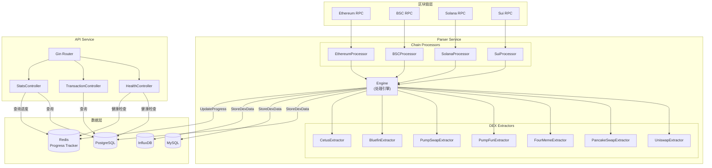
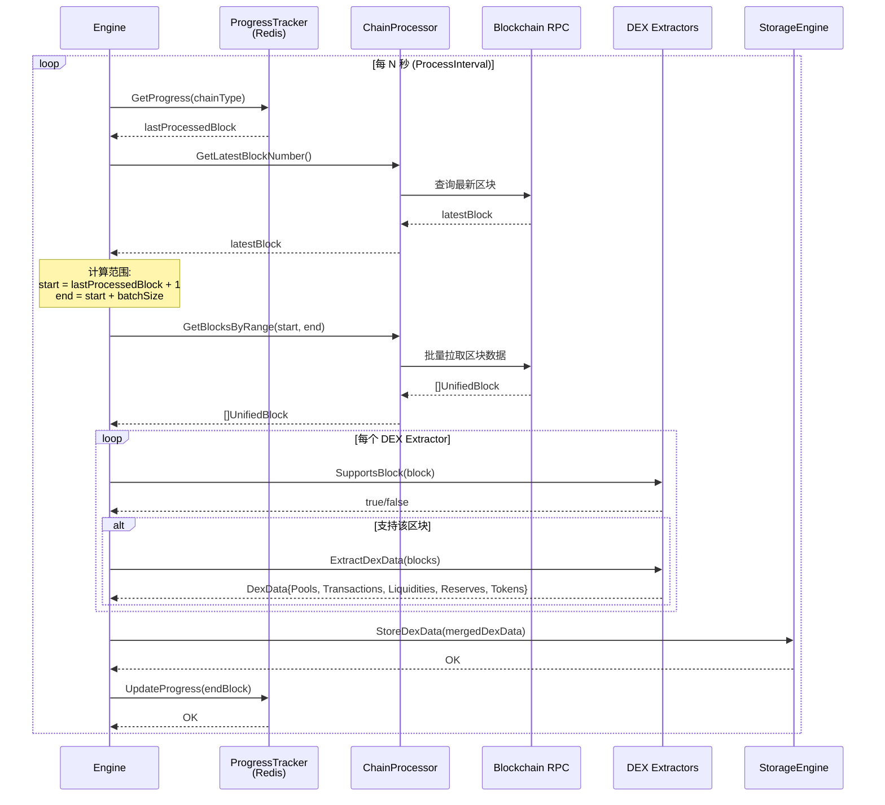
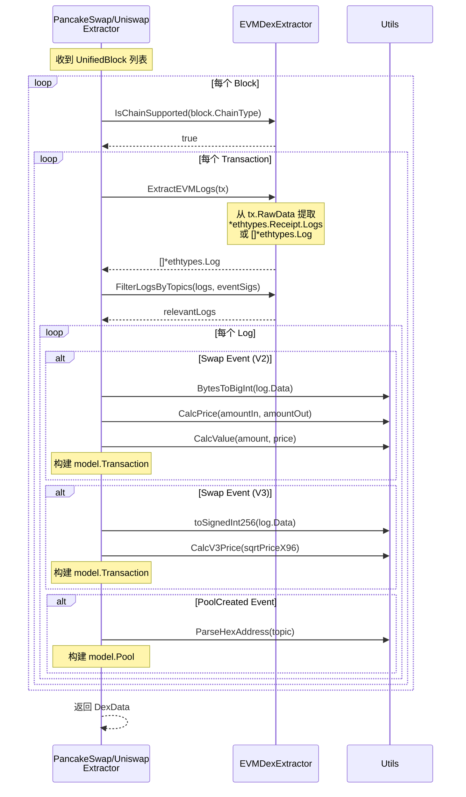
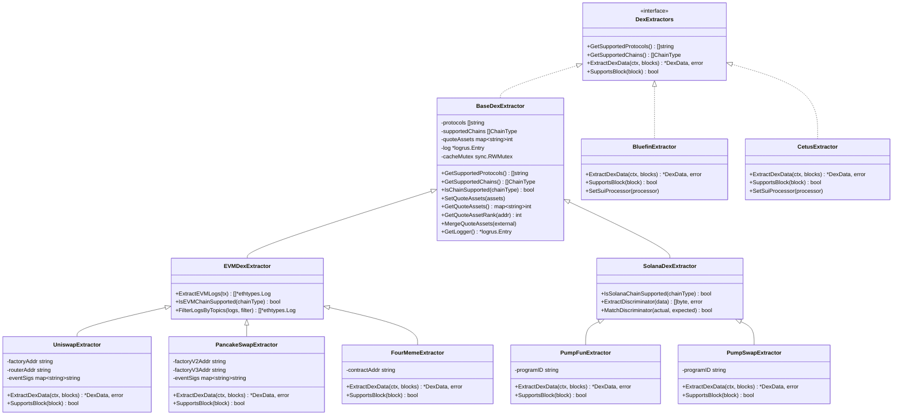
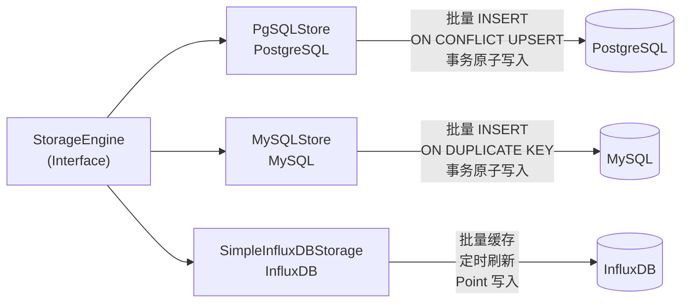
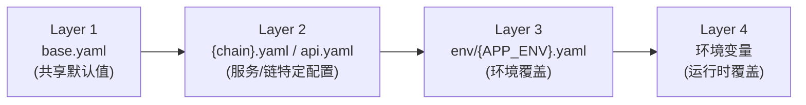
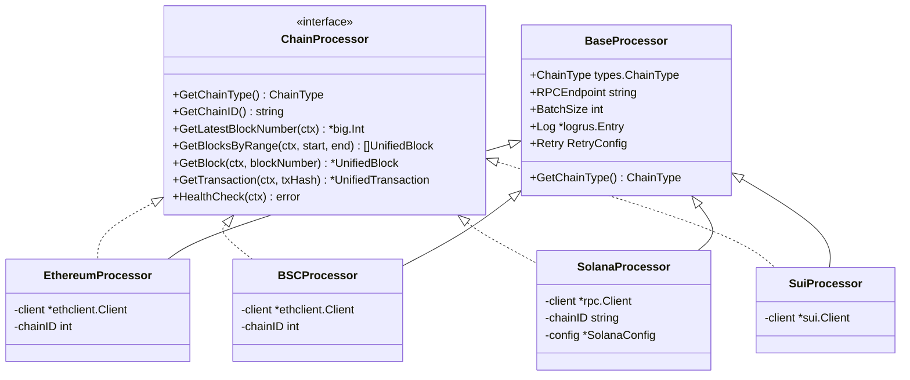
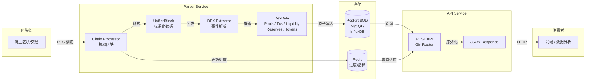

# Chain Parse Service 系统架构文档

> 本文档面向新加入项目的开发者，目标是读完后能理解系统的完整运作方式。

---

## 1. 项目概述

Chain Parse Service 是一个多链 DEX（去中心化交易所）数据解析服务。它通过连接多条区块链网络的 RPC 节点，实时抓取链上区块和交易数据，从中提取 DEX 协议相关的事件（Swap 交易、流动性增减、池子创建等），解析后持久化存储，并通过 REST API 对外提供查询服务。

系统当前支持以下链和协议：

| 链 | 支持的 DEX 协议 |
|---|---|
| **Ethereum** | Uniswap V2/V3 |
| **BSC** | PancakeSwap V2/V3, FourMeme V1/V2 |
| **Solana** | PumpFun, PumpSwap |
| **Sui** | Bluefin, Cetus |

系统由两个独立服务组成：
- **Parser Service** -- 负责区块抓取、事件解析和数据存储
- **API Service** -- 负责对外提供数据查询接口

---

## 2. 技术栈

| 类别 | 技术 | 版本 | 说明 |
|------|------|------|------|
| 后端语言 | Go | 1.21 | 所有后端服务使用 Go 编写 |
| Web 框架 | Gin | v1.9.1 | API 服务的 HTTP 路由框架 |
| 日志 | logrus | v1.9.0 | 结构化日志，按 service/module 分类 |
| 关系数据库 | PostgreSQL (lib/pq) | v1.10.9 | 主存储引擎 |
| 关系数据库 | MySQL (go-sql-driver) | v1.7.1 | 备选存储引擎 |
| 时序数据库 | InfluxDB (influxdb-client-go) | v2.4.0 | 时序数据存储引擎 |
| 缓存/进度 | Redis (go-redis) | v9.3.0 | 区块处理进度跟踪 |
| 以太坊交互 | go-ethereum | v1.13.5 | EVM 链 RPC 通信、日志解析 |
| Solana 交互 | solana-go | v1.8.4 | Solana RPC 通信 |
| Sui 交互 | sui-go-sdk | v1.0.9 | Sui RPC 通信 |
| Base58 编解码 | mr-tron/base58 | v1.2.0 | Solana 公钥编解码 |
| 配置管理 | gopkg.in/yaml.v3 | v3.0.1 | 分层 YAML 配置 |
| 测试 | testify | v1.11.1 | 测试断言和 Mock |

---

## 3. 系统架构图



---

## 4. 服务模块说明

### 4.1 Parser Service (`cmd/parser/main.go`)

Parser Service 是系统的核心服务，负责区块链数据的抓取、解析和存储。

**启动流程：**
1. 通过 `-chain` 参数或 `CHAIN_TYPE` 环境变量指定要解析的链
2. 加载分层配置（base.yaml -> {chain}.yaml -> env overlay -> 环境变量）
3. 初始化存储引擎（PgSQL/MySQL/InfluxDB）
4. 初始化 Redis 进度跟踪器
5. 注册对应链的 ChainProcessor
6. 注册配置中启用的 DEX Extractors，注入 Quote Assets
7. 启动 Engine，为每条链创建独立的处理协程

**关键职责：**
- 按批次从链上拉取区块数据
- 将区块数据分发给各 DEX Extractor 进行解析
- 将解析结果（Pool、Transaction、Liquidity、Reserve、Token）原子写入数据库
- 在 Redis 中维护每条链的处理进度，支持断点续传

### 4.2 API Service (`cmd/api/main.go`)

API Service 提供 RESTful 查询接口，供外部系统获取解析后的数据。

**API 端点：**

| 方法 | 路径 | 说明 |
|------|------|------|
| GET | `/health` | 系统健康检查 |
| GET | `/api/v1/transactions/:hash` | 按哈希查询交易 |
| GET | `/api/v1/storage/stats` | 存储统计信息 |
| GET | `/api/v1/progress` | 链处理进度 |
| GET | `/api/v1/progress/stats` | 全局处理统计 |

**中间件栈：**
- `RequestID` -- 为每个请求生成唯一 ID
- `Logger` -- 请求日志记录
- `Recovery` -- Panic 恢复
- `CORS` -- 跨域资源共享

**架构分层：**
```
Router -> Controller -> Service -> Storage/ProgressTracker
```

---

## 5. 核心业务流程

### 5.1 区块处理流程



### 5.2 EVM DEX 事件解析流程



---

## 6. DEX Extractor 架构

### 6.1 类层次结构



### 6.2 基类职责分工

| 基类 | 职责 | 关键方法 |
|------|------|----------|
| **BaseDexExtractor** | 协议/链类型管理、Quote Asset 管理、日志、线程安全 | `IsChainSupported()`, `GetQuoteAssetRank()`, `GetLogger()` |
| **EVMDexExtractor** | EVM 日志提取、日志过滤、EVM 链校验 | `ExtractEVMLogs()`, `FilterLogsByTopics()`, `IsEVMChainSupported()` |
| **SolanaDexExtractor** | 字节解析(LE)、Discriminator 匹配、Borsh 反序列化 | `ParseU64LE()`, `ExtractDiscriminator()`, `MatchDiscriminator()` |

### 6.3 工厂模式注册

DEX Extractor 通过 `ExtractorFactory` 统一注册和管理：

```go
// 默认工厂 -- 注册所有 Extractor
factory := CreateDefaultFactory()

// 按配置创建 -- 仅注册已启用的协议
factory := CreateFactoryWithConfig(protocolsCfg)
```

工厂支持按链类型查询、按协议查询、批量获取等操作。

### 6.4 缓存系统

系统提供泛型 TTL 缓存 `CacheManager[T]`，线程安全（`sync.RWMutex`），支持自动过期清理。基于此构建了专用缓存：

| 缓存类型 | 用途 | 典型 TTL |
|----------|------|----------|
| `TokenCache` | Token 元数据缓存 | 1 小时 |
| `PoolObjectCache` | Sui Pool Object 缓存 | 5 分钟 |
| `BatchTokenCache` | 按资产地址分组的 Token 缓存 | 可配置 |

---

## 7. 存储层架构

### 7.1 存储接口

所有存储引擎实现统一的 `StorageEngine` 接口：

```go
type StorageEngine interface {
    StoreBlocks(ctx, blocks)
    StoreTransactions(ctx, txs)
    StoreDexData(ctx, dexData)
    GetTransactionsByHash(ctx, hashes) ([]UnifiedTransaction, error)
    GetStorageStats(ctx) (map[string]interface{}, error)
    HealthCheck(ctx) error
    Close() error
}
```

### 7.2 存储实现对比



| 特性 | PostgreSQL | MySQL | InfluxDB |
|------|-----------|-------|----------|
| **写入策略** | 多行 INSERT + ON CONFLICT | 多行 INSERT + ON DUPLICATE KEY | 批量缓存 + 定时刷新 |
| **事务支持** | 完整 ACID | 完整 ACID | 无事务 |
| **批次大小** | 500 行/批 | 500 行/批 | 可配置 batchSize |
| **冲突处理** | UPSERT | INSERT IGNORE / ON DUPLICATE | 按时间戳覆盖 |
| **查询能力** | 完整 SQL | 完整 SQL | Flux 查询语言 |
| **适用场景** | 生产主选 | 兼容旧系统 | 时序分析 |

### 7.3 数据表结构

DEX 数据包含五类实体，对应数据库表：

| 表名 | 说明 | 唯一键/冲突策略 |
|------|------|-----------------|
| `dex_pools` | 交易池 | `addr` UPSERT |
| `dex_tokens` | 代币元数据 | `addr` UPSERT |
| `dex_transactions` | Swap 交易 | `(hash, event_index, side)` INSERT IGNORE |
| `dex_liquidities` | 流动性事件 | `(key, addr)` INSERT IGNORE |
| `dex_reserves` | 储备快照 | `(addr, time)` UPSERT |

### 7.4 进度跟踪

进度跟踪器 (`ProgressTracker`) 基于 Redis 实现，存储以下信息：

- **处理进度** -- 每条链的最后处理区块号、总交易数、总事件数
- **处理状态** -- idle / running / paused / error / syncing / catching_up
- **错误历史** -- 最近 1000 条错误记录（Redis List）
- **性能指标** -- 处理时间、吞吐量、内存/CPU 使用（Redis List，最近 10000 条）

Redis Key 命名规范：
```
{prefix}:progress:{chain}    -- 处理进度 (JSON)
{prefix}:stats:{chain}       -- 处理统计 (JSON)
{prefix}:errors:{chain}      -- 错误历史 (List)
{prefix}:metrics:{chain}     -- 性能指标 (List)
{prefix}:global_stats        -- 全局统计 (JSON)
```

---

## 8. 配置管理

### 8.1 分层合并策略

配置加载遵循四层合并策略，后加载的层覆盖前面的值：



### 8.2 配置文件结构

```
configs/
  base.yaml       -- 所有服务共享的默认值（API、Redis、存储、处理器参数）
  sui.yaml         -- Sui 链特定配置（RPC 地址、链 ID、协议启用）
  bsc.yaml         -- BSC 链特定配置
  ethereum.yaml    -- Ethereum 链特定配置
  solana.yaml      -- Solana 链特定配置
  api.yaml         -- API 服务专用配置
  env/
    dev.yaml       -- 开发环境覆盖
    staging.yaml   -- 预发布环境覆盖
    prod.yaml      -- 生产环境覆盖
```

### 8.3 合并规则

| 字段类型 | 合并行为 |
|----------|----------|
| 标量值（string/int/float） | 非零值覆盖 |
| Map（Chains/Protocols） | 按 key 合并，不替换整个 map |
| Slice（QuoteAssets/AllowOrigins） | 整体替换 |

### 8.4 环境变量覆盖

所有环境变量以 `CP_` 为前缀，使用下划线分隔层级：

| 环境变量 | 对应配置路径 |
|----------|-------------|
| `CP_LOG_LEVEL` | `logging.level` |
| `CP_STORAGE_TYPE` | `storage.type` |
| `CP_PGSQL_HOST` | `storage.pgsql.host` |
| `CP_PGSQL_PASSWORD` | `storage.pgsql.password` |
| `CP_API_PORT` | `api.port` |
| `CP_RPC_ENDPOINT_SUI` | `chains.sui.rpc_endpoint` |
| `APP_ENV` | 控制加载哪个环境覆盖文件 |

---

## 9. Chain Processor 架构

### 9.1 接口定义

每条链的处理器实现 `ChainProcessor` 接口：

```go
type ChainProcessor interface {
    GetChainType() ChainType
    GetChainID() string
    GetLatestBlockNumber(ctx) (*big.Int, error)
    GetBlocksByRange(ctx, start, end) ([]UnifiedBlock, error)
    GetBlock(ctx, blockNumber) (*UnifiedBlock, error)
    GetTransaction(ctx, txHash) (*UnifiedTransaction, error)
    HealthCheck(ctx) error
}
```

### 9.2 处理器继承结构



### 9.3 数据统一化

各链处理器的核心职责是将链原生数据转换为统一的 `UnifiedBlock` / `UnifiedTransaction` 结构：

- **EVM 链** (Ethereum/BSC) -- 将 `*ethtypes.Receipt` 放入 `tx.RawData`，供 EVM Extractor 提取日志
- **Solana** -- 将交易元数据和账户信息组装为 `map[string]any` 放入 `tx.RawData`，供 Solana Extractor 解析事件
- **Sui** -- 将 Move 事件数据放入 `block.Events`

#### Solana RawData 结构

Solana Processor 将以下字段写入 `tx.RawData`（`map[string]any`）：

| 字段 | 类型 | 说明 |
|------|------|------|
| `logMessages` | `[]string` | 交易执行日志，Extractor 从中提取 `Program data:` 行并 base64 解码得到事件数据 |
| `innerInstructions` | `[]map[string]any` | 内部指令列表，每项含 `index` (外部指令索引) 和 `instructions` |
| `accountKeys` | `[]string` | 交易涉及的所有账户地址（含 Address Lookup Table 解析后的地址） |
| `preTokenBalances` | `[]rpc.TokenBalance` | 交易前 SPL Token 余额快照 |
| `postTokenBalances` | `[]rpc.TokenBalance` | 交易后 SPL Token 余额快照 |
| `meta` | `map[string]any` | 交易元信息，含 `fee` (手续费) 和 `err` (错误信息) |

#### Solana V0 Versioned Transaction 支持

Solana Processor 通过设置 `MaxSupportedTransactionVersion = 0`，同时支持 Legacy 和 V0 Versioned Transaction：
- `GetBlockWithOpts` 和 `GetTransaction` 均传入该参数，确保 RPC 不会拒绝包含 V0 交易的区块
- V0 交易使用 Address Lookup Table，Processor 将 `Meta.LoadedAddresses`（Writable + ReadOnly）追加到 `accountKeys` 中

#### Solana 失败交易过滤

`convertBlockTransactions` 在遍历区块交易时，跳过 `Meta.Err != nil` 的失败交易。失败交易不会产生有效的 DEX 事件，过滤后可减少无效解析并提升处理效率。

### 9.4 重试机制

`BaseProcessor` 提供统一的重试配置（`base.RetryConfig`）：
- 默认最大重试 3 次
- 指数退避策略（基础延迟 1s，最大延迟 30s，倍数 2.0）
- 每次 RPC 调用设置 30 秒超时

Solana Processor 使用与 BSC Processor 一致的 `base.Retry()` 模式，在 `GetLatestBlockNumber`、`getBlockWithRetry`、`GetTransaction` 等方法中统一应用。

---

## 10. 数据流图

### 10.1 端到端数据流（解析方向）



### 10.2 数据流详细说明

| 阶段 | 输入 | 处理 | 输出 |
|------|------|------|------|
| **区块拉取** | RPC 区块号范围 | 批量 RPC 调用，超时 5 分钟 | `[]UnifiedBlock` |
| **支持性检查** | `UnifiedBlock` | 检查链类型、扫描日志签名 | 过滤后的 block 列表 |
| **事件提取** | `UnifiedBlock` | 日志提取、事件签名匹配、字节解析 | `*DexData` |
| **数据合并** | 多个 Extractor 的 `DexData` | 追加合并五类数据 | 合并后的 `*DexData` |
| **持久化** | `*DexData` | 数据库事务，分批 INSERT (500 行/批) | 写入成功/失败 |
| **进度更新** | 最新处理区块号 | Redis SET | 进度快照 |

---

## 11. 关键设计决策与模式

### 11.1 组合优于继承

Go 没有类继承，项目通过结构体嵌入实现代码复用：

```
UniswapExtractor
  -> 嵌入 EVMDexExtractor
    -> 嵌入 BaseDexExtractor
```

每一层只关注自己的职责，避免深层继承带来的复杂性。

### 11.2 接口驱动设计

系统的三大核心组件均通过接口解耦：

| 接口 | 作用 | 实现数量 |
|------|------|----------|
| `ChainProcessor` | 链适配器 | 4 (ETH, BSC, SOL, SUI) |
| `DexExtractors` | DEX 解析器 | 7 (Uniswap, PancakeSwap, FourMeme, PumpFun, PumpSwap, Bluefin, Cetus) |
| `StorageEngine` | 存储引擎 | 3 (PgSQL, MySQL, InfluxDB) |
| `ProgressTracker` | 进度跟踪 | 1 (Redis) |

### 11.3 工厂模式

DEX Extractor 通过 `ExtractorFactory` 统一注册和管理，支持：
- 按配置动态启用/禁用协议
- 按链类型查询可用的 Extractor
- 启动时注入 Quote Assets 配置

### 11.4 统一数据模型

引入 `UnifiedBlock` / `UnifiedTransaction` / `UnifiedEvent` 屏蔽链间差异。各链的原始数据保留在 `RawData` 字段中，供 Extractor 按需解析。

### 11.5 批量处理与事务安全

- **区块拉取** -- 按 `batchSize` 批量拉取，减少 RPC 调用次数
- **数据库写入** -- 每 500 行一批 multi-row INSERT，整个 `StoreDexData` 包裹在单个数据库事务中
- **进度更新** -- 数据写入成功后才更新进度，保证数据不丢失

### 11.6 线程安全

- Quote Assets 配置通过 `sync.RWMutex` 保护，支持运行时更新
- 缓存系统（`CacheManager[T]`）使用 `sync.RWMutex`，读多写少场景性能优良
- Engine 状态（running、chainProcessors 等）通过 `sync.RWMutex` 保护

### 11.7 依赖注入

Engine 采用手动依赖注入模式：
1. `RegisterChainProcessor()` -- 注入链处理器
2. `RegisterDexExtractor()` -- 注入 DEX 提取器（自动注入已注册的链处理器）
3. `SetStorageEngine()` -- 注入存储引擎
4. `SetProgressTracker()` -- 注入进度跟踪器

特别地，Sui 链的 DEX Extractor（Bluefin、Cetus）通过 `SuiProcessorInjectable` 接口接收 SuiProcessor 引用，用于链上查询。

### 11.8 优雅关闭

两个服务均通过监听 `SIGINT` / `SIGTERM` 信号实现优雅关闭：
- Parser Service -- 调用 `engine.Stop()` 取消所有链处理协程的 context
- API Service -- 调用 `srv.Shutdown(ctx)` 等待在途请求完成（超时 30 秒）

---

## 附录：项目目录结构

```
chain-parse-service/
  cmd/
    parser/main.go           -- Parser 服务入口
    api/main.go              -- API 服务入口
  configs/
    base.yaml                -- 共享默认配置
    sui.yaml                 -- Sui 链配置
    bsc.yaml                 -- BSC 链配置
    ethereum.yaml            -- Ethereum 链配置
    solana.yaml              -- Solana 链配置
    api.yaml                 -- API 服务配置
  internal/
    api/
      controller/            -- HTTP 控制器 (health, transaction, stats)
      middleware/             -- 中间件 (cors, logger, recovery, requestid)
      service/               -- 业务服务层
      router/                -- 路由注册
    app/                     -- 应用初始化工具 (storage/tracker 创建)
    config/                  -- 配置加载与合并
    errors/                  -- 自定义错误类型
    logger/                  -- 日志工具
    model/                   -- 数据模型 (Pool, Transaction, Liquidity, Reserve, Token)
    parser/
      chains/
        base/                -- 链处理器基类 + 重试配置
        bsc/                 -- BSC 处理器
        ethereum/            -- Ethereum 处理器
        solana/              -- Solana 处理器
        sui/                 -- Sui 处理器
      dexs/
        base_extractor.go    -- DEX 提取器基类
        evm_extractor.go     -- EVM 提取器基类
        solana_extractor.go  -- Solana 提取器基类
        utils.go             -- 共享工具函数
        cache.go             -- 泛型 TTL 缓存
        extractor.go         -- 通用 DEX 提取器
        extractor_factory.go -- 提取器工厂 (旧版)
        factory/             -- 提取器工厂 (新版，含协议注册)
        bsc/                 -- BSC DEX (PancakeSwap, FourMeme)
        eth/                 -- Ethereum DEX (Uniswap)
        solanadex/           -- Solana DEX (PumpFun, PumpSwap)
        suidex/              -- Sui DEX (Bluefin, Cetus)
      engine/                -- 处理引擎
    storage/
      pgsql/                 -- PostgreSQL 存储引擎
      mysql/                 -- MySQL 存储引擎
      influxdb/              -- InfluxDB 存储引擎
      redis/                 -- Redis 进度跟踪器
    types/                   -- 类型定义与接口
    utils/                   -- 通用工具函数
  docs/                      -- 文档
  Makefile                   -- 构建脚本
```

---

**最后更新**: 2026-03-08
**版本**: 1.0
