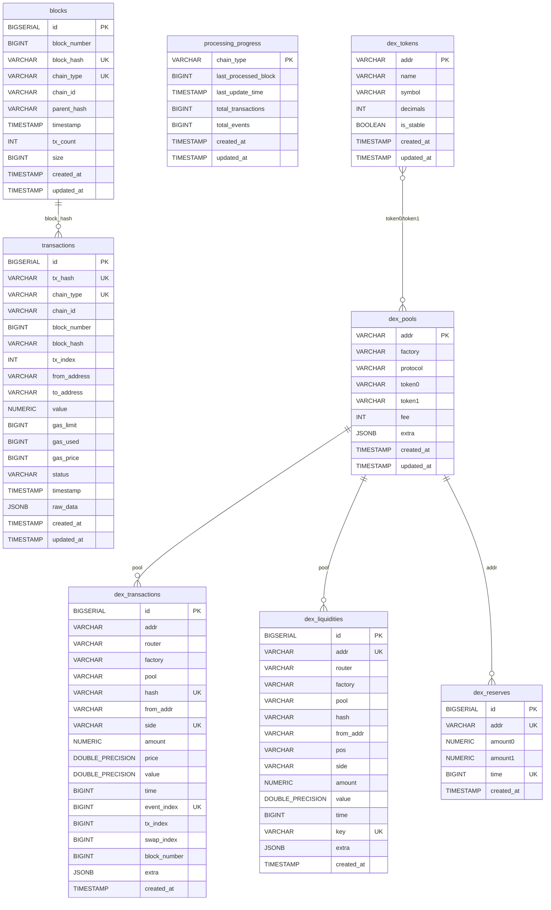

# Chain Parse Service - 数据库设计文档

## 1. 数据库概述

### 1.1 技术栈

| 组件 | 技术选型 | 版本 | 用途 |
|------|----------|------|------|
| 关系型数据库（主） | PostgreSQL | 16+ | 结构化数据持久存储（默认推荐） |
| 关系型数据库（备选） | MySQL | 8.0+ | 结构化数据持久存储（可选） |
| 时序数据库 | InfluxDB | 2.7+ | 时序数据存储与分析 |
| 缓存 / 进度跟踪 | Redis | 7+ | 解析进度跟踪、性能指标、错误记录 |

### 1.2 设计原则

1. **多引擎支持**：通过 `StorageEngine` 接口抽象，支持 PostgreSQL、MySQL、InfluxDB 三种存储后端，配置切换无需改代码
2. **多链统一**：所有链的数据共用同一套表结构，通过 `chain_type` 字段区分
3. **批量写入**：所有写入操作采用批量 INSERT，每批最多 500 行（`batchChunkSize = 500`），避免超出数据库参数限制
4. **事务原子性**：DEX 数据（池子、代币、交易、流动性、储备）在同一个数据库事务中写入，保证一致性
5. **冲突处理**：使用 UPSERT（`ON CONFLICT ... DO UPDATE` / `ON DUPLICATE KEY UPDATE`）确保幂等性
6. **JSONB 扩展**：使用 JSONB/JSON 字段存储半结构化数据（原始交易数据、扩展信息），兼顾灵活性和查询能力

---

## 2. ER 关系图



---

## 3. 表结构详细说明

### 3.1 blocks - 区块表

存储各链的区块元数据。

| 字段 | 类型 (PgSQL) | 类型 (MySQL) | 约束 | 说明 |
|------|-------------|-------------|------|------|
| `id` | BIGSERIAL | BIGINT AUTO_INCREMENT | PRIMARY KEY | 自增主键 |
| `block_number` | BIGINT | BIGINT | NOT NULL | 区块号 |
| `block_hash` | VARCHAR(128) | VARCHAR(128) | NOT NULL, UNIQUE(与chain_type) | 区块哈希 |
| `chain_type` | VARCHAR(32) | VARCHAR(32) | NOT NULL, UNIQUE(与block_hash) | 链类型（bsc/ethereum/solana/sui） |
| `chain_id` | VARCHAR(64) | VARCHAR(64) | NOT NULL | 链 ID（如 bsc-mainnet） |
| `parent_hash` | VARCHAR(128) | VARCHAR(128) | | 父区块哈希 |
| `timestamp` | TIMESTAMP | TIMESTAMP | | 区块时间 |
| `tx_count` | INT | INT | DEFAULT 0 | 区块内交易数量 |
| `size` | BIGINT | BIGINT | DEFAULT 0 | 区块大小（字节） |
| `created_at` | TIMESTAMP | TIMESTAMP | DEFAULT NOW() | 记录创建时间 |
| `updated_at` | TIMESTAMP | TIMESTAMP | DEFAULT NOW() | 记录更新时间 |

**唯一约束：** `(block_hash, chain_type)`

**索引：**

| 索引名 | 字段 | 说明 |
|--------|------|------|
| `idx_blocks_chain_number` | `(chain_type, block_number)` | 按链查询特定区块号 |
| `idx_blocks_timestamp` | `(timestamp)` | 按时间范围查询 |

**冲突策略：** 相同 `(block_hash, chain_type)` 时更新 `block_number`、`tx_count`、`size`、`updated_at`

---

### 3.2 transactions - 基础交易表

存储各链的原始交易数据。

| 字段 | 类型 (PgSQL) | 类型 (MySQL) | 约束 | 说明 |
|------|-------------|-------------|------|------|
| `id` | BIGSERIAL | BIGINT AUTO_INCREMENT | PRIMARY KEY | 自增主键 |
| `tx_hash` | VARCHAR(128) | VARCHAR(128) | NOT NULL, UNIQUE(与chain_type) | 交易哈希 |
| `chain_type` | VARCHAR(32) | VARCHAR(32) | NOT NULL, UNIQUE(与tx_hash) | 链类型 |
| `chain_id` | VARCHAR(64) | VARCHAR(64) | NOT NULL | 链 ID |
| `block_number` | BIGINT | BIGINT | | 区块号 |
| `block_hash` | VARCHAR(128) | VARCHAR(128) | | 区块哈希 |
| `tx_index` | INT | INT | | 交易在区块中的位置 |
| `from_address` | VARCHAR(128) | VARCHAR(128) | | 发送方地址 |
| `to_address` | VARCHAR(128) | VARCHAR(128) | | 接收方地址 |
| `value` | NUMERIC(78,0) | DECIMAL(65,0) | | 交易金额（原始精度） |
| `gas_limit` | BIGINT | BIGINT | | Gas 上限 |
| `gas_used` | BIGINT | BIGINT | | 实际使用 Gas |
| `gas_price` | BIGINT | BIGINT | | Gas 价格 |
| `status` | VARCHAR(32) | VARCHAR(32) | | 交易状态 |
| `timestamp` | TIMESTAMP | TIMESTAMP | | 交易时间 |
| `raw_data` | JSONB | JSON | | 原始交易数据 |
| `created_at` | TIMESTAMP | TIMESTAMP | DEFAULT NOW() | 记录创建时间 |
| `updated_at` | TIMESTAMP | TIMESTAMP | DEFAULT NOW() | 记录更新时间 |

**唯一约束：** `(tx_hash, chain_type)`

**索引：**

| 索引名 | 字段 | 说明 |
|--------|------|------|
| `idx_ut_chain_block` | `(chain_type, block_number)` | 按链和区块号查询 |
| `idx_ut_timestamp` | `(timestamp)` | 按时间范围查询 |
| `idx_ut_from_address` | `(from_address)` | 按发送方查询 |
| `idx_ut_to_address` | `(to_address)` | 按接收方查询 |

**冲突策略：** 相同 `(tx_hash, chain_type)` 时更新所有业务字段及 `updated_at`

---

### 3.3 processing_progress - 处理进度表

记录各链的区块解析进度。

| 字段 | 类型 (PgSQL) | 类型 (MySQL) | 约束 | 说明 |
|------|-------------|-------------|------|------|
| `chain_type` | VARCHAR(32) | VARCHAR(32) | PRIMARY KEY | 链类型 |
| `last_processed_block` | BIGINT | BIGINT | NOT NULL, DEFAULT 0 | 最后处理的区块号 |
| `last_update_time` | TIMESTAMP | TIMESTAMP | | 最后更新时间 |
| `total_transactions` | BIGINT | BIGINT | DEFAULT 0 | 已处理交易总数 |
| `total_events` | BIGINT | BIGINT | DEFAULT 0 | 已处理事件总数 |
| `created_at` | TIMESTAMP | TIMESTAMP | DEFAULT NOW() | 记录创建时间 |
| `updated_at` | TIMESTAMP | TIMESTAMP | DEFAULT NOW() | 记录更新时间 |

> **注意：** 实际运行时进度数据主要存储在 Redis 中（通过 `RedisProgressTracker`），此表用于数据库层面的持久化备份。

---

### 3.4 dex_pools - DEX 池子表

存储 DEX 交易对（流动性池）信息。

| 字段 | 类型 (PgSQL) | 类型 (MySQL) | 约束 | 说明 |
|------|-------------|-------------|------|------|
| `addr` | VARCHAR(256) | VARCHAR(256) | PRIMARY KEY | 池子合约地址 |
| `factory` | VARCHAR(256) | VARCHAR(256) | NOT NULL | 工厂合约地址 |
| `protocol` | VARCHAR(64) | VARCHAR(64) | NOT NULL | 协议名称（pancakeswap/uniswap/bluefin 等） |
| `token0` | VARCHAR(256) | VARCHAR(256) | | 代币 0 地址 |
| `token1` | VARCHAR(256) | VARCHAR(256) | | 代币 1 地址 |
| `fee` | INT | INT | DEFAULT 0 | 手续费率（基点，如 3000 = 0.3%） |
| `extra` | JSONB | JSON | | 扩展信息（创建交易哈希、发起者、稳定币标记等） |
| `created_at` | TIMESTAMP | TIMESTAMP | DEFAULT NOW() | 记录创建时间 |
| `updated_at` | TIMESTAMP | TIMESTAMP | DEFAULT NOW() | 记录更新时间 |

**索引：**

| 索引名 | 字段 | 说明 |
|--------|------|------|
| `idx_dp_protocol` | `(protocol)` | 按协议查询 |
| `idx_dp_factory` | `(factory)` | 按工厂地址查询 |

**冲突策略：** 相同 `addr` 时更新 `factory`、`protocol`、`token0`、`token1`、`fee`，`extra` 仅在新值非空时更新

**extra 字段结构（PoolExtra）：**

```json
{
  "tx_hash": "0x...",
  "tx_from": "0x...",
  "tx_time": 1709900000,
  "stable": false
}
```

---

### 3.5 dex_tokens - DEX 代币表

存储 DEX 涉及的代币元数据。

| 字段 | 类型 (PgSQL) | 类型 (MySQL) | 约束 | 说明 |
|------|-------------|-------------|------|------|
| `addr` | VARCHAR(256) | VARCHAR(256) | PRIMARY KEY | 代币合约地址 |
| `name` | VARCHAR(128) | VARCHAR(128) | | 代币名称 |
| `symbol` | VARCHAR(64) | VARCHAR(64) | | 代币符号 |
| `decimals` | INT | INT | DEFAULT 0 | 小数位数 |
| `is_stable` | BOOLEAN | BOOLEAN | DEFAULT FALSE | 是否为稳定币 |
| `created_at` | TIMESTAMP | TIMESTAMP | DEFAULT NOW() | 记录创建时间 |
| `updated_at` | TIMESTAMP | TIMESTAMP | DEFAULT NOW() | 记录更新时间 |

**冲突策略：** 相同 `addr` 时更新 `name`、`symbol`、`decimals`、`is_stable`

---

### 3.6 dex_transactions - DEX 交易表

存储 DEX Swap 交易事件数据。这是系统最核心的业务表。

| 字段 | 类型 (PgSQL) | 类型 (MySQL) | 约束 | 说明 |
|------|-------------|-------------|------|------|
| `id` | BIGSERIAL | BIGINT AUTO_INCREMENT | PRIMARY KEY | 自增主键 |
| `addr` | VARCHAR(256) | VARCHAR(256) | NOT NULL | 代币地址 |
| `router` | VARCHAR(256) | VARCHAR(256) | | 路由合约地址 |
| `factory` | VARCHAR(256) | VARCHAR(256) | | 工厂合约地址 |
| `pool` | VARCHAR(256) | VARCHAR(256) | NOT NULL | 池子地址 |
| `hash` | VARCHAR(128) | VARCHAR(128) | NOT NULL, UNIQUE(三字段) | 交易哈希 |
| `from_addr` | VARCHAR(256) | VARCHAR(256) | | 交易发起方 |
| `side` | VARCHAR(16) | VARCHAR(16) | NOT NULL, UNIQUE(三字段) | 交易方向（buy/sell） |
| `amount` | NUMERIC(78,0) | DECIMAL(65,0) | | 交易数量（原始精度） |
| `price` | DOUBLE PRECISION | DOUBLE | DEFAULT 0 | 成交价格 |
| `value` | DOUBLE PRECISION | DOUBLE | DEFAULT 0 | 成交价值（USD） |
| `time` | BIGINT | BIGINT | NOT NULL | 交易时间（Unix 时间戳） |
| `event_index` | BIGINT | BIGINT | DEFAULT 0, UNIQUE(三字段) | 事件在交易中的索引 |
| `tx_index` | BIGINT | BIGINT | DEFAULT 0 | 交易在区块中的索引 |
| `swap_index` | BIGINT | BIGINT | DEFAULT 0 | Swap 在交易内的索引 |
| `block_number` | BIGINT | BIGINT | DEFAULT 0 | 区块号 |
| `extra` | JSONB | JSON | | 扩展信息 |
| `created_at` | TIMESTAMP | TIMESTAMP | DEFAULT NOW() | 记录创建时间 |

**唯一约束：** `(hash, event_index, side)`

**索引：**

| 索引名 | 字段 | 说明 |
|--------|------|------|
| `idx_dt_pool` | `(pool)` | 按池子查询交易 |
| `idx_dt_time` | `(time)` | 按时间范围查询 |
| `idx_dt_block` | `(block_number)` | 按区块号查询 |

**冲突策略：** 相同 `(hash, event_index, side)` 时忽略（`ON CONFLICT DO NOTHING` / `INSERT IGNORE`）

**extra 字段结构（TransactionExtra）：**

```json
{
  "quote_addr": "0x55d398326f99059fF775485246999027B3197955",
  "quote_price": "1.0",
  "type": "swap",
  "token_symbol": "CAKE",
  "token_decimals": 18
}
```

---

### 3.7 dex_liquidities - DEX 流动性表

存储流动性添加/移除事件。

| 字段 | 类型 (PgSQL) | 类型 (MySQL) | 约束 | 说明 |
|------|-------------|-------------|------|------|
| `id` | BIGSERIAL | BIGINT AUTO_INCREMENT | PRIMARY KEY | 自增主键 |
| `addr` | VARCHAR(256) | VARCHAR(256) | NOT NULL, UNIQUE(与key) | 代币地址 |
| `router` | VARCHAR(256) | VARCHAR(256) | | 路由合约地址 |
| `factory` | VARCHAR(256) | VARCHAR(256) | | 工厂合约地址 |
| `pool` | VARCHAR(256) | VARCHAR(256) | NOT NULL | 池子地址 |
| `hash` | VARCHAR(128) | VARCHAR(128) | NOT NULL | 交易哈希 |
| `from_addr` | VARCHAR(256) | VARCHAR(256) | | 操作发起方 |
| `pos` | VARCHAR(256) | VARCHAR(256) | | 流动性位置（V3 tick range） |
| `side` | VARCHAR(16) | VARCHAR(16) | NOT NULL | 操作方向（add/remove） |
| `amount` | NUMERIC(78,0) | DECIMAL(65,0) | | 数量 |
| `value` | DOUBLE PRECISION | DOUBLE | DEFAULT 0 | 价值（USD） |
| `time` | BIGINT | BIGINT | NOT NULL | 时间戳 |
| `key` | VARCHAR(512) | VARCHAR(512) | UNIQUE(与addr) | 唯一标识键 |
| `extra` | JSONB | JSON | | 扩展信息 |
| `created_at` | TIMESTAMP | TIMESTAMP | DEFAULT NOW() | 记录创建时间 |

**唯一约束：** `(key, addr)`

**索引：**

| 索引名 | 字段 | 说明 |
|--------|------|------|
| `idx_dl_pool` | `(pool)` | 按池子查询 |
| `idx_dl_time` | `(time)` | 按时间范围查询 |

**冲突策略：** 相同 `(key, addr)` 时忽略

---

### 3.8 dex_reserves - DEX 储备表

存储池子的代币储备量快照。

| 字段 | 类型 (PgSQL) | 类型 (MySQL) | 约束 | 说明 |
|------|-------------|-------------|------|------|
| `id` | BIGSERIAL | BIGINT AUTO_INCREMENT | PRIMARY KEY | 自增主键 |
| `addr` | VARCHAR(256) | VARCHAR(256) | NOT NULL, UNIQUE(与time) | 池子地址 |
| `amount0` | NUMERIC(78,0) | DECIMAL(65,0) | | 代币 0 储备量 |
| `amount1` | NUMERIC(78,0) | DECIMAL(65,0) | | 代币 1 储备量 |
| `time` | BIGINT | BIGINT | NOT NULL, UNIQUE(与addr) | 时间戳 |
| `created_at` | TIMESTAMP | TIMESTAMP | DEFAULT NOW() | 记录创建时间 |

**唯一约束：** `(addr, time)`

**索引：**

| 索引名 | 字段 | 说明 |
|--------|------|------|
| `idx_dr_time` | `(time)` | 按时间范围查询 |

**冲突策略：** 相同 `(addr, time)` 时更新 `amount0`、`amount1`

---

## 4. 数据模型与 Go 结构体映射

### 4.1 Transaction（DEX 交易）

**Go 结构体** (`internal/model/transaction.go`)：

```go
type Transaction struct {
    Addr        string            `json:"addr"`
    Router      string            `json:"router"`
    Factory     string            `json:"factory"`
    Pool        string            `json:"pool"`
    Hash        string            `json:"hash"`
    From        string            `json:"from"`
    Side        string            `json:"side"`
    Amount      *big.Int          `json:"amount"`
    Price       float64           `json:"price"`
    Value       float64           `json:"value"`
    Time        uint64            `json:"time"`
    Extra       *TransactionExtra `json:"extra"`
    EventIndex  int64             `json:"index"`
    TxIndex     int64             `json:"txIndex"`
    SwapIndex   int64             `json:"swapIndex"`
    BlockNumber int64             `json:"blockNumber"`
}

type TransactionExtra struct {
    QuoteAddr     string `json:"quote_addr"`
    QuotePrice    string `json:"quote_price"`
    Type          string `json:"type"`
    TokenSymbol   string `json:"token_symbol"`
    TokenDecimals int    `json:"token_decimals"`
}
```

**字段映射：** `Amount (*big.Int)` -> `amount NUMERIC(78,0)` 通过 `utils.BigIntToNullString()` 转换；`Extra` -> `extra JSONB` 通过 `utils.ToJSON()` 序列化

### 4.2 Pool（流动性池）

**Go 结构体** (`internal/model/pool.go`)：

```go
type Pool struct {
    Addr     string                 `json:"addr"`
    Factory  string                 `json:"factory"`
    Protocol string                 `json:"protocol"`
    Tokens   map[int]string         `json:"tokens"`
    Args     map[string]interface{} `json:"args,omitempty"`
    Extra    *PoolExtra             `json:"extra,omitempty"`
    Fee      int                    `json:"fee"`
}
```

**字段映射：** `Tokens[0]` -> `token0`、`Tokens[1]` -> `token1`，手动从 map 中提取

### 4.3 Token（代币）

**Go 结构体** (`internal/model/token.go`)：

```go
type Token struct {
    Addr         string  `json:"addr"`
    Name         string  `json:"name"`
    Symbol       string  `json:"symbol"`
    Decimals     int     `json:"decimals"`
    TRLThreshold int     `json:"trlThreshold,omitempty"`
    IsStable     bool    `json:"is_stable"`
    CreatedAt    string  `json:"created_at,omitempty"`
    UsdPrice     float64 `json:"price_usd,omitempty"`
}
```

> 注意：`TRLThreshold`、`CreatedAt`、`UsdPrice` 仅在内存/InfluxDB 中使用，不持久化到关系型数据库

### 4.4 Liquidity（流动性事件）

**Go 结构体** (`internal/model/liquidity.go`)：

```go
type Liquidity struct {
    Addr    string          `json:"addr"`
    Router  string          `json:"router"`
    Factory string          `json:"factory"`
    Pool    string          `json:"pool"`
    Hash    string          `json:"hash"`
    From    string          `json:"from"`
    Pos     string          `json:"pos"`
    Side    string          `json:"side"`
    Amount  *big.Int        `json:"amount"`
    Value   float64         `json:"value"`
    Time    uint64          `json:"time"`
    Key     string          `json:"key"`
    Extra   *LiquidityExtra `json:"extra,omitempty"`
}
```

### 4.5 Reserve（储备快照）

**Go 结构体** (`internal/model/reserve.go`)：

```go
type Reserve struct {
    Addr    string           `json:"addr"`
    Amounts map[int]*big.Int `json:"amounts"`
    Time    uint64           `json:"time"`
    Value   map[int]float64  `json:"value,omitempty"`
}
```

**字段映射：** `Amounts[0]` -> `amount0`、`Amounts[1]` -> `amount1`

---

## 5. 存储引擎对比

| 特性 | PostgreSQL | MySQL | InfluxDB |
|------|-----------|-------|----------|
| **配置值** | `pgsql`（默认） | `mysql` | `influxdb` |
| **数据模型** | 关系型 | 关系型 | 时序型 |
| **JSON 支持** | JSONB（可索引、可查询） | JSON（有限查询） | 标签 + 字段 |
| **大数值** | NUMERIC(78,0) | DECIMAL(65,0) | 字符串 |
| **冲突处理** | `ON CONFLICT ... DO UPDATE/NOTHING` | `ON DUPLICATE KEY UPDATE` / `INSERT IGNORE` | 按时间戳覆盖 |
| **事务写入** | 支持 | 支持 | 不支持（批量缓存） |
| **查询交易** | 完整支持 | 完整支持 | 返回空结果 |
| **批量写入** | 多行 VALUES + 参数占位符（$1...$N） | 多行 VALUES + ? 占位符 | 逐条写入 Point |
| **适用场景** | 通用查询 + 存储（推荐） | 团队熟悉 MySQL 时 | 时序分析、Grafana 看板 |
| **SSL** | 支持（sslmode 参数） | 不支持（当前实现） | Token 认证 |
| **连接池** | MaxOpen/MaxIdle/MaxLifetime | MaxOpen/MaxIdle | 内置连接管理 |

### 5.1 InfluxDB 特殊说明

InfluxDB 存储引擎采用了与关系型数据库不同的写入策略：

- **批量缓存机制**：数据先缓存在内存中，达到 `batch_size`（默认 1000 条）或超过 `flush_time`（默认 10 秒）后批量写入
- **UPSERT 模拟**：通过先查询再决定写入标记（`created` / `updated`）模拟 UPSERT
- **定时刷新**：后台 goroutine 定期检查并刷新缓存
- **关闭安全**：服务关闭前自动刷新剩余缓存
- **查询限制**：`GetTransactionsByHash` 返回空结果，不适用于 API 查询场景
- **每链独立 Bucket**：各链配置独立的 InfluxDB bucket（如 `bsc`、`ethereum`、`sui`、`solana`）

---

## 6. Redis 数据结构

Redis 用于进度跟踪（`RedisProgressTracker`），不存储业务数据。键名前缀默认为 `unified_tx_parser`。

| 键模式 | 类型 | 说明 |
|--------|------|------|
| `{prefix}:progress:{chain}` | String (JSON) | 链处理进度（ProcessProgress） |
| `{prefix}:stats:{chain}` | String (JSON) | 链处理统计（ProcessingStats） |
| `{prefix}:errors:{chain}` | List (JSON[]) | 错误历史（最多 1000 条，LIFO） |
| `{prefix}:metrics:{chain}` | List (JSON[]) | 性能指标历史（最多 10000 条，LIFO） |
| `{prefix}:global_stats` | String (JSON) | 全局统计（计算得出） |
| `{prefix}:health_check` | String | 健康检查临时键（TTL 1 分钟） |

---

## 7. 查询模式与索引策略

### 7.1 主要查询模式

| 查询场景 | SQL 模式 | 使用索引 |
|----------|----------|----------|
| 按哈希查交易 | `WHERE tx_hash IN (...)` | `uk_tx_hash_chain` |
| 按链和区块查交易 | `WHERE chain_type = ? AND block_number = ?` | `idx_ut_chain_block` |
| 按地址查交易 | `WHERE from_address = ?` | `idx_ut_from_address` |
| 统计各链交易数 | `GROUP BY chain_type` | `uk_tx_hash_chain` |
| 按池子查 DEX 交易 | `WHERE pool = ?` | `idx_dt_pool` |
| 按时间查 DEX 交易 | `WHERE time BETWEEN ? AND ?` | `idx_dt_time` |
| 按区块查 DEX 交易 | `WHERE block_number = ?` | `idx_dt_block` |
| 按协议查池子 | `WHERE protocol = ?` | `idx_dp_protocol` |
| 全表计数 | `SELECT COUNT(*)` | 全表扫描 |

### 7.2 索引设计原则

1. **唯一约束即索引**：所有唯一约束自动创建唯一索引，兼顾查询和数据完整性
2. **写入优先**：表索引数量克制（每表 2-3 个），避免批量写入时索引维护开销过大
3. **复合索引前缀**：`(chain_type, block_number)` 等复合索引的首字段为高选择性字段
4. **时间索引**：所有包含时间字段的表均建立时间索引，支持范围查询和数据清理

### 7.3 性能优化建议

- **大批量写入**：系统已内置分块写入（每 500 行），避免单次 INSERT 参数过多（PostgreSQL 上限 65535 个参数）
- **连接池调优**：生产环境建议 `max_open_conns: 200`、`max_idle_conns: 20`、`conn_max_lifetime: 1800s`
- **分区策略**：当 `dex_transactions` 数据量超过 1 亿行时，建议按 `time` 字段进行范围分区
- **归档策略**：定期将历史数据归档至 InfluxDB 或冷存储，保持关系型数据库查询性能
